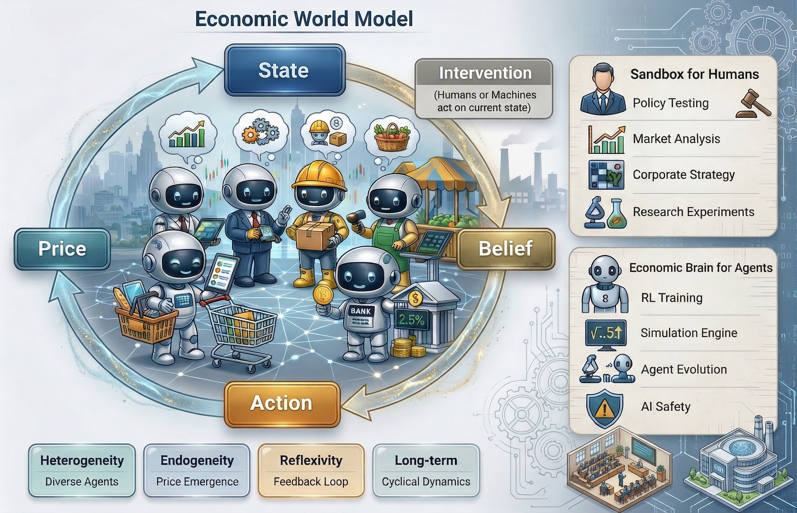
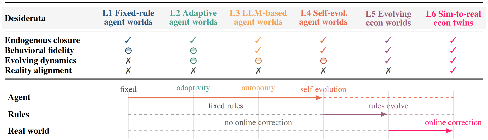
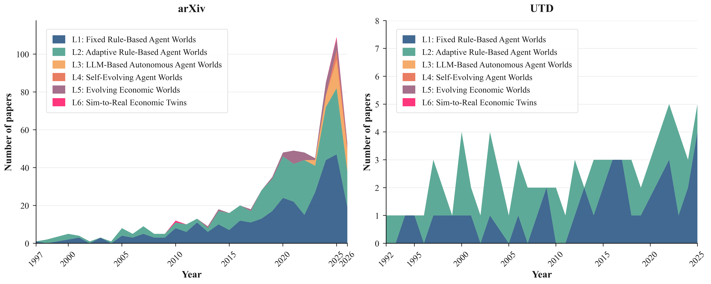
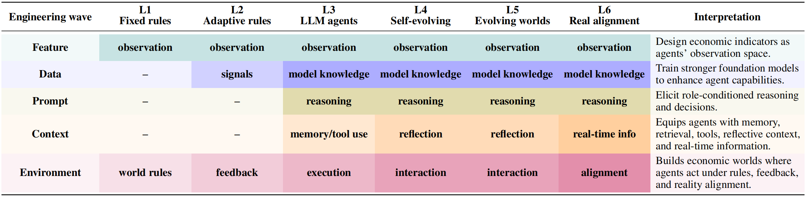

<h1 align="center">Awesome Economic World Models 🌐</h1>

  
  <!-- 
  
  -->
  A curated collection of papers, projects, and resources on Economic World Models.

  

  

## 🌟 News & Updates

Major updates and announcements are shown below. Scroll for full timeline.

- 🔥 **[2026-05-13] Major Structural Update**  
  Removed the original "Economic World Models" section. Added two new sections: **The World-Building Ladder: A Taxonomy of Economic World Models' Capabilities** (L1-L6 capability ladder) and **How We Arrived at Economic World Models** (five engineering waves: Feature, Data, Prompt, Context, and Environment Engineering).

- 📰 **[2026-03-24] First Release**  
  **Awesome Economic World Models** is now live! We're building a comprehensive collection of papers and resources on Economic World Models.

## 🗂️ Table of Contents

- [Getting Started with World Models](#-getting-started-with-world-models)
  - [Surveys and Tutorials](#-surveys-and-tutorials)
  - [General World Models](#-general-world-models)
  - [Generative and Interactive World Models](#-generative-and-interactive-world-models)
  
- [Blogs and Perspectives](#-blogs-and-perspectives)

- [The World-Building Ladder: A Taxonomy of Economic World Models' Capabilities](#-the-world-building-ladder-a-taxonomy-of-economic-world-models-capabilities)
  - [L1: Fixed Rule-Based Agent Worlds](#-l1-fixed-rule-based-agent-worlds)
  - [L2: Adaptive Rule-Based Agent Worlds](#-l2-adaptive-rule-based-agent-worlds)
  - [L3: LLM-Based Autonomous Agent Worlds](#-l3-llm-based-autonomous-agent-worlds)
  - [L4: Self-Evolving Agent Worlds](#-l4-self-evolving-agent-worlds)
  - [L5: Evolving Economic Worlds](#-l5-evolving-economic-worlds)
  - [L6: Sim-to-Real Economic Twins](#-l6-sim-to-real-economic-twins)

- [How We Arrived at Economic World Models](#-how-we-arrived-at-economic-world-models)
  - [Feature Engineering](#-feature-engineering)
  - [Data Engineering](#-data-engineering)
  - [Prompt Engineering](#-prompt-engineering)
  - [Context Engineering](#-context-engineering)
  - [Environment Engineering](#-environment-engineering)
  
- [Applications](#-applications)
  - [Sandbox for Humans](#-sandbox-for-humans)
  - [Economic Brain for Machines](#-economic-brain-for-machines)

- [Benchmark](#-benchmark)

- [Projects and Platforms](#️-projects-and-platforms)

---

## 🚀 Getting Started with World Models

<h3 id="-surveys-and-tutorials"> 📚 Surveys and Tutorials</h3>

Broad overviews that help newcomers understand the landscape.

- "The rise and potential of large language model based agents: A survey", `arXiv 2023.09`. [[Paper](https://arxiv.org/abs/2309.07864)]

- "Is Sora a World Simulator? A Comprehensive Survey on General World Models and Beyond", `arxiv 2024.05`. [[Paper](https://arxiv.org/abs/2405.03520)]

- "World models for autonomous driving: An initial survey", `IEEE Transactions on Intelligent Vehicles 2024.05`. [[Paper](https://ieeexplore.ieee.org/abstract/document/10522953)]

- "A review of prominent paradigms for llm-based agents: Tool use, planning (including rag), and feedback learning", `Proceedings of the 31st international conference on computational linguistics 2024.06`. [[Paper](https://arxiv.org/abs/2406.05804v6)]

- "From Efficient Multimodal Models to World Models: A Survey", `arxiv 2024.07`. [[Paper](https://arxiv.org/abs/2407.00118)]

- "Understanding World or Predicting Future? A Survey of World Models", `arxiv 2024.11`. [[Paper](https://arxiv.org/abs/2411.14499)]

- "Agentic AI: Autonomous intelligence for complex goals—A comprehensive survey", `IEEE Access 2025.01`. [[Paper](https://doi.org/10.1109/ACCESS.2025.3532853)]

- "A Comprehensive Survey on World Models for Embodied AI", `arxiv 2025.10`. [[Paper](https://arxiv.org/abs/2510.16732)]

- "Learning to Model the World: A Survey of World Models in Artificial Intelligence", `Preprints.org 2026.03`. [[Paper](https://www.preprints.org/manuscript/202603.0739)]

<h3 id="-general-world-models"> 🔹 General World Models</h3>

Foundational papers that shape the modern notion of learning internal models of environment dynamics.

- "World Models", `arxiv 2018.03`. [[Paper](https://arxiv.org/abs/1803.10122)]

- "Recurrent World Models Facilitate Policy Evolution", `NeurIPS 2018.12`. [[Paper](https://proceedings.neurips.cc/paper/2018/hash/2de5d16682c3c35007e4e92982f1a2ba-Abstract.html)]

- "Dream to Control: Learning Behaviors by Latent Imagination", `arxiv 2019.12`. [[Paper](https://arxiv.org/abs/1912.01603)]

- "Mastering Atari with Discrete World Models (DreamerV2)", `arxiv 2020.10`. [[Paper](https://arxiv.org/abs/2010.02193)]

- "A Generalist Agent", `arxiv 2022.05`. [[Paper](https://arxiv.org/abs/2205.06175)]

- "A Path Towards Autonomous Machine Intelligence (JEPA)", `OpenReview 2022.06`. [[Paper](https://openreview.net/pdf?id=BZ5a1r-kVsf&utm_source=pocket_mylist)]

- "A path towards autonomous machine intelligence version 0.9. 2, 2022-06-27", `OpenReview 2022.06`. [[Paper](https://openreview.net/forum?id=BZ5a1r-kVsf)]

- "Inner Monologue: Embodied Reasoning through Planning with Language Models", `arxiv 2022.07`. [[Paper](https://arxiv.org/abs/2207.05608)]

- "Mastering Diverse Domains through World Models (DreamerV3)", `arxiv 2023.01`. [[Paper](https://arxiv.org/abs/2301.04104)]

- "Language Models Represent Space and Time, arxiv", `2023.10`. [[Paper](https://arxiv.org/abs/2310.02207)]

- "Mastering Diverse Control Tasks Through World Models, Nature", `2025.04`. [[Paper](https://www.nature.com/articles/s41586-025-08744-2)]

- "General Agents Need World Models", `ICML 2025.07`. [[Paper](https://openreview.net/forum?id=dlIoumNiXt)]

<h3 id="-generative-and-interactive-world-models"> 🎬 Generative and Interactive World Models</h3>

Representative works that extend world models from latent RL environments to multimodal generation, interactive simulation, and embodied environments.

- **MineDojo**: "Building Open-Ended Embodied Agents with Internet-Scale Knowledge", `NeurIPS 2022.12`. [[Paper](https://proceedings.neurips.cc/paper_files/paper/2022/hash/74a67268c5cc5910f64938cac4526a90-Abstract-Datasets_and_Benchmarks.html)]

- **Lang-WM**: "Learning to Model the World with Language", `arxiv 2023.08`. [[Paper](https://arxiv.org/abs/2308.01399)]

- **GAIA-1**: "A Generative World Model for Autonomous Driving", `arxiv 2023.09`. [[Paper](https://arxiv.org/abs/2309.17080)]

- **UniSim**: "Learning Interactive Real-World Simulators", `arxiv 2023.10`. [[Paper](https://arxiv.org/abs/2310.06114)]

- **Sora**: "Video Generation Models as World Simulators", `OpenAI Blog 2024.02`. [[Paper](https://openai.com/index/video-generation-models-as-world-simulators/)]

- **Genie**: "Generative Interactive Environments", `OpenReview 2024.02`. [[Paper](https://openreview.net/forum?id=bJbSbJskOS)]

- **MineDreamer**: "Learning to Follow Instructions via Chain-of-Imagination for Simulated-World Control", `arxiv 2024.03`. [[Paper](https://arxiv.org/abs/2403.12037)]

- **SIMA/SIMA 2**: "Scalable Instructable Multiworld Agent", `Google DeepMind Blog 2024.03`. [[Paper](https://deepmind.google/blog/sima-generalist-ai-agent-for-3d-virtual-environments/)]

- **Pandora**: "Towards General World Model with Natural Language Actions and Video States", `arxiv 2024.06`. [[Paper](https://arxiv.org/abs/2406.09455)]

- **Genie 2**: "A Large-Scale Foundation World Model", `Google DeepMind Blog 2024.08`. [[Paper](https://deepmind.google/blog/genie-2-a-large-scale-foundation-world-model/)]

- **Project Sid**: "Many-agent simulations toward AI civilization", `arxiv 2024.11`. [[Paper](https://arxiv.org/abs/2411.00114)]

- **Sim-gen**: "Simulator-conditioned driving scene generation", `NeurIPS 2024.12`. [[Paper](https://proceedings.neurips.cc/paper_files/paper/2024/hash/57c5a7c83b056d74bc97b7db36bd3649-Abstract-Conference.html)]

- **Embodied WM Survey**: "Embodied AI Agents: Modeling the World", `arxiv 2025.06`. [[Paper](https://arxiv.org/abs/2506.22355)]

- **From LLM to WM**: "Embodied AI: From LLMs to World Models", `arxiv 2025.09`. [[Paper](https://arxiv.org/abs/2509.20021)]

- **EgoAgent**: "A Joint Predictive Agent Model in Egocentric Worlds", `ICCV 2025.10`. [[Paper](https://openaccess.thecvf.com/content/ICCV2025/html/Chen_EgoAgent_A_Joint_Predictive_Agent_Model_in_Egocentric_Worlds_ICCV_2025_paper.html)]

- **HERMES**: "A Unified Self-Driving World Model for Simultaneous 3D Scene Understanding and Generation", `ICCV 2025.10`. [[Paper](https://openaccess.thecvf.com/content/ICCV2025/html/Zhou_HERMES_A_Unified_Self-Driving_World_Model_for_Simultaneous_3D_Scene_ICCV_2025_paper.html)]
---

## 📝 Blogs and Perspectives

 Details

- World Models: Computing the Uncomputable, `2026.03`. [[link]](https://www.notboring.co/p/world-models) [[WeChat repost]](https://mp.weixin.qq.com/s/JY3mpKYyCqnTNdPR2mne0w)

- V-JEPA: The next step toward Yann LeCun’s vision of advanced machine intelligence (AMI), `2024.02`. [[link]](https://ai.meta.com/blog/v-jepa-yann-lecun-ai-model-video-joint-embedding-predictive-architecture/)

- Yann LeCun on a vision to make AI systems learn and reason like animals and humans, `2022.02`. [[link]](https://ai.meta.com/blog/yann-lecun-advances-in-ai-research/)

- Yann LeCun: AI Doesn’t Need Our Supervision, `2022.02`. [[link]](https://spectrum.ieee.org/yann-lecun-ai)
---

## 🪜 The World-Building Ladder: A Taxonomy of Economic World Models' Capabilities

> An Economic World Model is a generative engine that predicts how an economy moves by modeling how its agents act. It simulates heterogeneous agents’ next actions, aggregates them through economic rules and market mechanisms into the next economic state, and allows both agents and rules to evolve over time.

To organize existing systems and clarify the path forward, we propose a six-level capability ladder. Moving upward, EconWMs progress from fixed rule-based simulations to adaptive agents, Large language model (LLM)-based autonomous agents, self-evolving agents, evolving economic institutions, and finally sim-to-real economic twins.

  

  

<h3 id="-l1-fixed-rule-based-agent-worlds"> 🏗️ L1: Fixed Rule-Based Agent Worlds</h3>

- **Asset Price Feedback Trades**: "ASSET PRICE DYNAMICS AND INFREQUENT FEEDBACK TRADES", `UTD-JF 1995.12`. [[Paper](https://dx.doi.org/10.2307/2329334)]

- **Screen-Based Securities Pricing**: "Information technology and screen-based securities trading: Pricing the stock and pricing the trade", `UTD-Manage. Sci. 1997.12`. [[Paper](https://dx.doi.org/10.1287/mnsc.43.12.1693)]

- **Unified Under-Overreaction**: "A unified theory of underreaction, momentum trading, and overreaction in asset markets", `UTD-JF 1999.12`. [[Paper](https://dx.doi.org/10.1111/0022-1082.00184)]

- **Multi-Scaling Markets**: "Scaling and Multi-scaling in Financial Markets", `arXiv 2000.07`. [[Paper](https://arxiv.org/abs/cond-mat/0007385v1)]

- **Organizational Innovation Adoption**: "The importance of organizational structure for the adoption of innovations", `UTD-Manage. Sci. 2000.10`. [[Paper](https://dx.doi.org/10.1287/mnsc.46.10.1285.12270)]

- **Simple Price Formation**: "A simple model of price formation", `arXiv 2001.01`. [[Paper](https://arxiv.org/abs/cond-mat/0101001v2)]

- **Bandwidth Market Dynamics**: "A Price Dynamics in Bandwidth Markets for Point-to-point Connections", `arXiv 2001.02`. [[Paper](https://arxiv.org/abs/cs/0102011v1)]

- **Wealth Power Laws**: "Power Laws of Wealth, Market Order Volumes and Market Returns", `arXiv 2001.02`. [[Paper](https://arxiv.org/abs/cond-mat/0102423v2)]

- **Contagion Wealth Effect**: "Contagion as a wealth effect", `UTD-JF 2001.08`. [[Paper](https://dx.doi.org/10.1111/0022-1082.00373)]

- **Ising Money Stability**: "Stability of money: Phase transitions in an Ising economy", `arXiv 2001.10`. [[Paper](https://arxiv.org/abs/cond-mat/0110201v1)]

- **Langevin Agent Models**: "Langevin processes, agent models and socio-economic systems", `arXiv 2003.09`. [[Paper](https://arxiv.org/abs/cond-mat/0309404v1)]

- **Yankee Auction Replication**: "Replicating online Yankee auctions to analyze auctioneers' and bidders' strategies", `UTD-ISR 2003.09`. [[Paper](https://dx.doi.org/10.1287/isre.14.3.244.16562)]

- **Cellular Automata Market**: "Stochastic Cellular Automata Model for Stock Market Dynamics", `arXiv 2003.11`. [[Paper](https://arxiv.org/abs/cond-mat/0311372v2)]

- **Superstatistics Econophysics**: "Superstatistics in Econophysics", `arXiv 2003.12`. [[Paper](https://arxiv.org/abs/cond-mat/0312568v1)]

- **Potts Financial Market**: "Simulations of financial markets in a Potts-like model", `arXiv 2005.03`. [[Paper](https://arxiv.org/abs/cond-mat/0503156v1)]

- **Ideal-Gas Money Models**: "Analyzing money distributions in `ideal gas' models of markets", `arXiv 2005.05`. [[Paper](https://arxiv.org/abs/physics/0505047v1)]

- **Wealth Distribution Review**: "Emergent Statistical Wealth Distributions in Simple Monetary Exchange Models: A Critical Review", `arXiv 2005.06`. [[Paper](https://arxiv.org/abs/cs/0506092v1)]

- **Speculative Bubbles ABM**: "Artificial Agents and Speculative Bubbles", `arXiv 2005.11`. [[Paper](https://arxiv.org/abs/cs/0511093v1)]

- **Log-Return Stylized Facts**: "Statistical properties of absolute log-returns and a stochastic model of stock markets with heterogeneous agents", `arXiv 2006.03`. [[Paper](https://arxiv.org/abs/physics/0603139v1)]

- **Co-Evolutionary TA Signals**: "Microeconomic co-evolution model for financial technical analysis signals", `arXiv 2006.05`. [[Paper](https://arxiv.org/abs/physics/0605179v1)]

- **Short-Selling Bubble Experiments**: "The effect of short selling on bubbles and crashes in experimental spot asset markets", `UTD-JF 2006.06`. [[Paper](https://dx.doi.org/10.1111/j.1540-6261.2006.00868.x)]

- **FX Tick Spectral ABM**: "Frequency analysis of tick quotes on the foreign exchange market and agent-based modeling: A spectral distance approach", `arXiv 2006.07`. [[Paper](https://arxiv.org/abs/physics/0607273v2)]

- **Queueing Price Theory**: "Queueing Theoretic Approaches to Financial Price Fluctuations", `arXiv 2007.03`. [[Paper](https://arxiv.org/abs/math/0703832v1)]

- **Chaos & Strategy**: "Chaos theory and strategy: Theory, application, and managerial implications", `UTD-SMJ 2007.06`. [[Paper](https://doi.org/10.1002/smj.4250151011)]

- **Empirical Behavioral Model**: "An empirical behavioral model of liquidity and volatility", `arXiv 2007.09`. [[Paper](https://arxiv.org/abs/0709.0159v1)]

- **Mean-Field Financial Fragility**: "Economic dynamics with financial fragility and mean-field interaction: a model", `arXiv 2007.09`. [[Paper](https://arxiv.org/abs/0709.2083v1)]

- **Threshold Market Model**: "A threshold model of financial markets", `arXiv 2007.11`. [[Paper](https://arxiv.org/abs/0711.3106v3)]

- **Coupled Exponential Maps**: "An Economic Model of Coupled Exponential Maps", `arXiv 2007.12`. [[Paper](https://arxiv.org/abs/0712.2684v1)]

- **Pareto-Boltzmann Multi-Agent**: "Pareto and Boltzmann-Gibbs behaviors in a deterministic multi-agent system", `arXiv 2008.01`. [[Paper](https://arxiv.org/abs/0801.0969v1)]

- **Mike-Farmer Returns**: "On the probability distribution of stock returns in the Mike-Farmer model", `arXiv 2008.05`. [[Paper](https://arxiv.org/abs/0805.3593v1)]

- **On-the-Run Search Theory**: "A search-based theory of the on-the-run phenomenon", `UTD-JF 2008.06`. [[Paper](https://dx.doi.org/10.1111/j.1540-6261.2008.01360.x)]

- **Mean-Field Breakdown**: "Breakdown of the mean-field approximation in a wealth distribution model", `arXiv 2008.09`. [[Paper](https://arxiv.org/abs/0809.4139v2)]

- **Chaotic Money Exchange**: "Economic Models with Chaotic Money Exchange", `arXiv 2009.01`. [[Paper](https://arxiv.org/abs/0901.1038v1)]

- **DM vs Crossing Network**: "Dynamic order submission strategies with competition between a dealer market and a crossing network", `UTD-JFE 2009.03`. [[Paper](https://dx.doi.org/10.1016/j.jfineco.2008.02.007)]

- **Wealth Statistical Mechanics**: "Colloquium: Statistical mechanics of money, wealth, and income", `arXiv 2009.05`. [[Paper](https://arxiv.org/abs/0905.1518v2)]

- **Order Book Asymmetry**: "Asymmetric statistics of order books: The role of discreteness and evidence for strategic order placement", `arXiv 2009.06`. [[Paper](https://arxiv.org/abs/0906.1387v3)]

- **Outsourcing Behavioral Operations**: "How to Win "Spend" and Influence Partners: Lessons in Behavioral Operations from the Outsourcing Game", `UTD-POM 2009.11`. [[Paper](https://dx.doi.org/10.1111/j.1937-5956.2009.01036.x)]

- **Space-Time Volatility Clustering**: "A new space-time model for volatility clustering in the financial market", `arXiv 2010.02`. [[Paper](https://arxiv.org/abs/1002.0609v1)]

- **Limit Order Book ABM**: "A Multi Agent Model for the Limit Order Book Dynamics", `arXiv 2010.05`. [[Paper](https://arxiv.org/abs/1005.0182v2)]

- **Mean-Field Universal Scaling**: "Emergence of universal scaling in financial markets from mean-field dynamics", `arXiv 2010.06`. [[Paper](https://arxiv.org/abs/1006.0628v1)]

- **Money Distribution**: "Statistical mechanics approach to the probability distribution of money", `arXiv 2010.07`. [[Paper](https://arxiv.org/abs/1007.5074v1)]

- **Money-Debt-Energy Stat Mech**: "Statistical mechanics of money, debt, and energy consumption", `arXiv 2010.08`. [[Paper](https://arxiv.org/abs/1008.2179v1)]

- **Mesoscopic Markets**: "Mesoscopic modelling of financial markets", `arXiv 2010.09`. [[Paper](https://arxiv.org/abs/1009.2743v1)]

- **Gas Economy Relaxation**: "Equilibrium distributions and relaxation times in gas-like economic models: an analytical derivation", `arXiv 2010.10`. [[Paper](https://arxiv.org/abs/1010.0208v2)]

- **Exponential-to-Power Markets**: "Transition from Exponential to Power Law Distributions in a Chaotic Market", `arXiv 2010.11`. [[Paper](https://arxiv.org/abs/1011.5187v1)]

- **Functional-Iteration Wealth**: "Exponential wealth distribution: a new approach from functional iteration theory", `arXiv 2011.03`. [[Paper](https://arxiv.org/abs/1103.1501v1)]

- **Random-Market Wealth Proof**: "Exponential wealth distribution in a random market. A rigorous explanation", `arXiv 2011.03`. [[Paper](https://arxiv.org/abs/1103.5703v3)]

- **Generalized Random Market**: "A Generalized Continuous Model for Random Markets", `arXiv 2011.04`. [[Paper](https://arxiv.org/abs/1104.2187v3)]

- **Supply Chain Market Protocol**: "Decentralized Supply Chain Formation: A Market Protocol and Competitive Equilibrium Analysis", `arXiv 2011.07`. [[Paper](https://arxiv.org/abs/1107.0021v1)]

- **Resource Allocation Negotiation**: "Negotiating Socially Optimal Allocations of Resources", `arXiv 2011.09`. [[Paper](https://arxiv.org/abs/1109.6340v1)]

- **Coupled-Oscillator Business Cycle**: "Coupled Oscillator Model of the Business Cycle with Fluctuating Goods Markets", `arXiv 2011.10`. [[Paper](https://arxiv.org/abs/1110.6679v1)]

- **Long-Memory Recurrence**: "Effects of long memory in the order submission process on the properties of recurrence intervals of large price fluctuations", `arXiv 2012.01`. [[Paper](https://arxiv.org/abs/1201.2825v1)]

- **Kelly Prediction Markets**: "Learning Performance of Prediction Markets with Kelly Bettors", `arXiv 2012.01`. [[Paper](https://arxiv.org/abs/1201.6655v1)]

- **Evolutionary Income Distribution**: "Evolutionary Model of the Personal Income Distribution", `arXiv 2012.03`. [[Paper](https://arxiv.org/abs/1203.6507v1)]

- **Bank Credit Distress**: "Transmission of distress in a bank credit network", `arXiv 2012.04`. [[Paper](https://arxiv.org/abs/1204.5661v2)]

- **Spatial Economic Patterns**: "Modelling the emergence of spatial patterns of economic activity", `arXiv 2012.04`. [[Paper](https://arxiv.org/abs/1204.6638v1)]

- **Netherlands Spatial Economy**: "Modelling spatial patterns of economic activity in the Netherlands", `arXiv 2012.05`. [[Paper](https://arxiv.org/abs/1205.0110v1)]

- **Heavy-Tailed ABM Returns**: "Microscopic understanding of heavy-tailed return distributions in an agent-based model", `arXiv 2012.07`. [[Paper](https://arxiv.org/abs/1207.2946v1)]

- **Directed Random Markets**: "Directed Random Markets: Connectivity determines Money", `arXiv 2012.08`. [[Paper](https://arxiv.org/abs/1208.0451v1)]

- **Network Wealth Distribution**: "Distribution Of Wealth In A Network Model Of The Economy", `arXiv 2012.08`. [[Paper](https://arxiv.org/abs/1208.2696v1)]

- **Bouchaud-Mézard Network**: "Bouchaud-Mézard model on a random network", `arXiv 2012.09`. [[Paper](https://arxiv.org/abs/1209.2467v1)]

- **Event-Tree Equilibria**: "Incomplete-Market Equilibria Solved Recursively on an Event Tree", `UTD-JF 2012.10`. [[Paper](https://dx.doi.org/10.1111/j.1540-6261.2012.01775.x)]

- **JADE Commodity Market**: "Design of Intelligent Agents Based System for Commodity Market Simulation with JADE", `arXiv 2012.12`. [[Paper](https://arxiv.org/abs/1212.6298v1)]

- **Sieczka-Hołyst Reinterpretation**: "Reinterpretation of Sieczka-Hołyst financial market model", `arXiv 2013.01`. [[Paper](https://arxiv.org/abs/1301.2535v1)]

- **Agent E-Commerce Reputation**: "Evaluating Reputation Systems for Agent Mediated e-Commerce", `arXiv 2013.03`. [[Paper](https://arxiv.org/abs/1303.7377v1)]

- **Defeasible Contractual Markets**: "Designing Electronic Markets for Defeasible-based Contractual Agents", `arXiv 2013.04`. [[Paper](https://arxiv.org/abs/1304.5545v1)]

- **Word-of-Mouth Seeding**: "Decomposing the Value of Word-of-Mouth Seeding Programs: Acceleration Versus Expansion", `UTD-JMR 2013.04`. [[Paper](https://dx.doi.org/10.1509/jmr.11.0305)]

- **Three-Group Herding Model**: "Fluctuation analysis of the three agent groups herding model", `arXiv 2013.05`. [[Paper](https://arxiv.org/abs/1305.5958v1)]

- **Stock Returns & Volume**: "Modeling of Stock Returns and Trading Volume", `arXiv 2013.09`. [[Paper](https://arxiv.org/abs/1309.2416v1)]

- **Systemic Volatility Simulation**: "What does the financial market pricing do? A simulation analysis with a view to systemic volatility, exuberance and vagary", `arXiv 2013.12`. [[Paper](https://arxiv.org/abs/1312.7460v1)]

- **Fire-Sale Complexity**: "Fire Sales in a Model of Complexity", `UTD-JF 2013.12`. [[Paper](https://dx.doi.org/10.1111/jofi.12087)]

- **Aoki vs Representative Agent**: "Microeconomic Structure determines Macroeconomic Dynamics. Aoki defeats the Representative Agent", `arXiv 2014.01`. [[Paper](https://arxiv.org/abs/1401.7496v1)]

- **New Product Exclusivity**: "When to Take or Forgo New Product Exclusivity: Balancing Protection from Competition Against Word-of-Mouth Spillover", `UTD-J. Mark. 2014.03`. [[Paper](https://dx.doi.org/10.1509/jm.12.0344)]

- **Ultra-HF Autocorrelations**: "Computational experiments successfully predict the emergence of autocorrelations in ultra-high-frequency stock returns", `arXiv 2014.04`. [[Paper](https://arxiv.org/abs/1404.1051v2)]

- **China Stock-Futures ABM**: "An agent-based computational model for China's stock market and stock index futures market", `arXiv 2014.04`. [[Paper](https://arxiv.org/abs/1404.1052v1)]

- **Humber Industrial Economy**: "A Dynamical Model of the Industrial Economy of the Humber Region", `arXiv 2014.04`. [[Paper](https://arxiv.org/abs/1404.3167v1)]

- **Aggregate Volatility Without Shocks**: "Instabilities in large economies: aggregate volatility without idiosyncratic shocks", `arXiv 2014.06`. [[Paper](https://arxiv.org/abs/1406.5022v1)]

- **Welfare Inequality Reduction**: "Microscopic Models for Welfare Measures Addressing a Reduction of Economic Inequality", `arXiv 2014.07`. [[Paper](https://arxiv.org/abs/1407.3749v2)]

- **Endogenous Crisis Waves**: "Endogenous crisis waves: a stochastic model with synchronized collective behavior", `arXiv 2014.09`. [[Paper](https://arxiv.org/abs/1409.3296v1)]

- **Herding Prevents Extremes**: "Herding interactions as an opportunity to prevent extreme events in financial markets", `arXiv 2014.09`. [[Paper](https://arxiv.org/abs/1409.8024v5)]

- **Trade Network Risk**: "Risk Dynamics in Trade Networks", `arXiv 2014.10`. [[Paper](https://arxiv.org/abs/1410.0413v2)]

- **Tsallis q-Exponential**: "Universality of Tsallis q-exponential of interoccurrence times within the microscopic model of cunning agents", `arXiv 2014.11`. [[Paper](https://arxiv.org/abs/1411.1689v1)]

- **Liquidity-Motivated LOB**: "Stochastic simulation framework for the Limit Order Book using liquidity motivated agents", `arXiv 2015.01`. [[Paper](https://arxiv.org/abs/1501.02447v3)]

- **Entrepreneurial Rents**: "TOWARD A THEORY OF ENTREPRENEURIAL RENTS: A SIMULATION OF THE MARKET PROCESS", `UTD-SMJ 2015.01`. [[Paper](https://dx.doi.org/10.1002/smj.2203)]

- **Threadneedle Banking Sim**: "Threadneedle: An Experimental Tool for the Simulation and Analysis of Fractional Reserve Banking Systems", `arXiv 2015.02`. [[Paper](https://arxiv.org/abs/1502.06163v1)]

- **Arbitrage Asset Pricing**: "Asset pricing with arbitrage activity", `UTD-JFE 2015.02`. [[Paper](https://dx.doi.org/10.1016/j.jfineco.2014.10.001)]

- **Multi-Level Herding ABM**: "Agent-based model with multi-level herding for complex financial systems", `arXiv 2015.04`. [[Paper](https://arxiv.org/abs/1504.01811v1)]

- **US-UK-Germany Transitions**: "Transitions in the Stock Markets of the US, UK, and Germany", `arXiv 2015.04`. [[Paper](https://arxiv.org/abs/1504.06113v1)]

- **Sustainability Transitions ABM**: "Modelling complex systems of heterogeneous agents to better design sustainability transitions policy", `arXiv 2015.06`. [[Paper](https://arxiv.org/abs/1506.07432v4)]

- **SOC Financial Markets**: "Modelling Financial Markets by Self-Organized Criticality", `arXiv 2015.07`. [[Paper](https://arxiv.org/abs/1507.04298v2)]

- **Simple Spatial Economy ABM**: "A simple agent-based spatial model of the economy: tools for policy", `arXiv 2015.10`. [[Paper](https://arxiv.org/abs/1510.04967v4)]

- **LOB Order Flow Intensities**: "Modelling intensities of order flows in a limit order book", `arXiv 2016.02`. [[Paper](https://arxiv.org/abs/1602.03944v1)]

- **Inequality Freeze Economy**: "When does inequality freeze an economy?", `arXiv 2016.02`. [[Paper](https://arxiv.org/abs/1602.07300v3)]

- **Overnight Bank Contagion**: "Can banks default overnight? Modeling endogenous contagion on O/N interbank market", `arXiv 2016.03`. [[Paper](https://arxiv.org/abs/1603.05142v1)]

- **RL-EGTA Double Auction**: "Using Reinforcement Learning to Validate Empirical Game-Theoretic Analysis: A Continuous Double Auction Study", `arXiv 2016.04`. [[Paper](https://arxiv.org/abs/1604.06710v1)]

- **Bank-Run Mean-Field Game**: "Mean field games of timing and models for bank runs", `arXiv 2016.06`. [[Paper](https://arxiv.org/abs/1606.03709v3)]

- **Groundwater Game-Theory MAS**: "Multi-Agent System for Groundwater Depletion Using Game Theory", `arXiv 2016.07`. [[Paper](https://arxiv.org/abs/1607.02376v1)]

- **Econophysics Monetary Economics**: "Monetary economics from econophysics perspective", `arXiv 2016.08`. [[Paper](https://arxiv.org/abs/1608.04832v1)]

- **Shared Consumption Lifecycle**: "The Effects of Shared Consumption on Product Life Cycles and Advertising Effectiveness: The Case of the Motion Picture Market", `UTD-JMR 2016.08`. [[Paper](https://dx.doi.org/10.1509/jmr.14.0097)]

- **SEAL Spatial ABM Lab**: "SEAL's operating manual: a Spatially-bounded Economic Agent-based Lab", `arXiv 2016.09`. [[Paper](https://arxiv.org/abs/1609.03996v1)]

- **Micro-Prudence Macro Risk**: "When Micro Prudence Increases Macro Risk: The Destabilizing Effects of Financial Innovation, Leverage, and Diversification", `UTD-Oper. Res. 2016.10`. [[Paper](https://dx.doi.org/10.1287/opre.2015.1464)]

- **Multi-Series Ising Market**: "Multiple Time Series Ising Model for Financial Market Simulations", `arXiv 2016.11`. [[Paper](https://arxiv.org/abs/1611.08088v1)]

- **Spot-Balancing Electricity ABM**: "Agent-based Model for Spot and Balancing Electricity Markets", `arXiv 2016.12`. [[Paper](https://arxiv.org/abs/1612.04512v1)]

- **Speculation Power Law**: "Speculation and Power Law", `arXiv 2016.12`. [[Paper](https://arxiv.org/abs/1612.08705v1)]

- **Random-Walk Volatility Clustering**: "The Random Walk behind Volatility Clustering", `arXiv 2016.12`. [[Paper](https://arxiv.org/abs/1612.09344v1)]

- **Competitive IS Benchmarking**: "COMPETITIVE BENCHMARKING: AN IS RESEARCH APPROACH TO ADDRESS WICKED PROBLEMS WITH BIG DATA AND ANALYTICS", `UTD-MIS Q. 2016.12`. [[Paper](https://dx.doi.org/10.25300/MISQ/2016/40.4.12)]

- **Econophysics Macro Model**: "Econophysics Macroeconomic Model", `arXiv 2017.01`. [[Paper](https://arxiv.org/abs/1701.06625v1)]

- **Action-at-Distance Waves**: "Econophysics of Macroeconomics: "Action-at-a-Distance" and Waves", `arXiv 2017.02`. [[Paper](https://arxiv.org/abs/1702.02763v1)]

- **SEAL Administrative Boundaries**: "An applied spatial agent-based model of administrative boundaries using SEAL", `arXiv 2017.02`. [[Paper](https://arxiv.org/abs/1702.03226v2)]

- **Interbank Credit & Money**: "Interbank Credit and the Money Manufacturing Process. A Systemic Perspective on Financial Stability", `arXiv 2017.02`. [[Paper](https://arxiv.org/abs/1702.08774v1)]

- **Inequality-Induced Crisis**: "Simple wealth distribution model causing inequality-induced crisis without external shocks", `arXiv 2017.04`. [[Paper](https://arxiv.org/abs/1704.06429v1)]

- **Macro-Finance Multifluid Waves**: "Econophysics of Macro-Finance: Local Multi-fluid Models and Surface-like Waves of Financial Variables", `arXiv 2017.06`. [[Paper](https://arxiv.org/abs/1706.01748v1)]

- **Credits-Loans Surface Waves**: "Non-Local Macroeconomic Transactions and Credits-Loans Surface-Like Waves", `arXiv 2017.06`. [[Paper](https://arxiv.org/abs/1706.07758v1)]

- **Bi-Level Energy Allocation**: "Distributed Bi-level Energy Allocation Mechanism with Grid Constraints and Hidden User Information", `arXiv 2017.07`. [[Paper](https://arxiv.org/abs/1707.05429v2)]

- **Business-Cycle Mean Risks**: "Econophysics of Business Cycles: Aggregate Economic Fluctuations, Mean Risks and Mean Square Risks", `arXiv 2017.09`. [[Paper](https://arxiv.org/abs/1709.00282v1)]

- **Decarbonizing Residential Heating**: "Simulating the deep decarbonisation of residential heating for limiting global warming to 1.5C", `arXiv 2017.10`. [[Paper](https://arxiv.org/abs/1710.11019v3)]

- **Renewable Local Market**: "Novel market approach for locally balancing renewable energy production and flexible demand", `arXiv 2017.11`. [[Paper](https://arxiv.org/abs/1711.09565v1)]

- **Two-Sided Video-Game Markets**: "Bayesian Estimation of a Dynamic Model of Two-Sided Markets: Application to the US Video Game Industry", `UTD-Manage. Sci. 2017.11`. [[Paper](https://dx.doi.org/10.1287/mnsc.2016.2529)]

- **Local Bargaining Supply Chain**: "Technical Note-Local Bargaining and Supply Chain Instability", `UTD-Oper. Res. 2017.12`. [[Paper](https://dx.doi.org/10.1287/opre.2017.1605)]

- **Dynamic Barter Exchange**: "Efficient Dynamic Barter Exchange", `UTD-Oper. Res. 2017.12`. [[Paper](https://dx.doi.org/10.1287/opre.2017.1644)]

- **Consumer-Based EV Stations**: "A Consumer Behavior Based Approach to Multi-Stage EV Charging Station Placement", `arXiv 2018.01`. [[Paper](https://arxiv.org/abs/1801.02135v1)]

- **Disaster Economic Losses**: "When does a disaster become a systemic event? Estimating indirect economic losses from natural disasters", `arXiv 2018.01`. [[Paper](https://arxiv.org/abs/1801.09740v1)]

- **Metro-Washington Ridesharing**: "Simulating the Ridesharing Economy: The Individual Agent Metro-Washington Area Ridesharing Model", `arXiv 2018.02`. [[Paper](https://arxiv.org/abs/1802.07280v1)]

- **Econophysics Business Cycle**: "Econophysics Beyond General Equilibrium: the Business Cycle Model", `arXiv 2018.04`. [[Paper](https://arxiv.org/abs/1804.04721v1)]

- **Islamic Charity Inequality**: "Economic inequality and Islamic Charity: An exploratory agent-based modeling approach", `arXiv 2018.04`. [[Paper](https://arxiv.org/abs/1804.09284v1)]

- **Intergenerational Wealth Trap**: "When a `rat race' implies an intergenerational wealth trap", `arXiv 2018.05`. [[Paper](https://arxiv.org/abs/1805.01019v1)]

- **Marriage-Divorce Dynamics**: "Single parameter model of marriage divorce dynamics with countries classification", `arXiv 2018.05`. [[Paper](https://arxiv.org/abs/1805.02878v1)]

- **Residential Energy Negotiation**: "Energy Contract Settlements through Automated Negotiation in Residential Cooperatives", `arXiv 2018.07`. [[Paper](https://arxiv.org/abs/1807.10978v4)]

- **Chiarella Trend-Value**: "Co-existence of Trend and Value in Financial Markets: Estimating an Extended Chiarella Model", `arXiv 2018.07`. [[Paper](https://arxiv.org/abs/1807.11751v1)]

- **XY Hysteresis Networks**: "Hysteresis of economic networks in an XY model", `arXiv 2018.08`. [[Paper](https://arxiv.org/abs/1808.03404v1)]

- **Negative Interest Rates**: "On the Normality of Negative Interest Rates", `arXiv 2018.08`. [[Paper](https://arxiv.org/abs/1808.07909v1)]

- **Path-Integral Business Cycles**: "A Path Integral Approach to Business Cycle Models with Large Number of Agents", `arXiv 2018.10`. [[Paper](https://arxiv.org/abs/1810.07178v1)]

- **Decentralized Financial Clearing**: "Decentralized Clearing in Financial Networks", `UTD-Manage. Sci. 2018.10`. [[Paper](https://dx.doi.org/10.1287/mnsc.2017.2847)]

- **PolicySpace Tax**: "Modeling tax distribution in metropolitan regions with PolicySpace", `arXiv 2019.01`. [[Paper](https://arxiv.org/abs/1901.02391v1)]

- **ABM Theory & Practice**: "Theories and Practice of Agent based Modeling: Some practical Implications for Economic Planners", `arXiv 2019.01`. [[Paper](https://arxiv.org/abs/1901.08932v1)]

- **Continuous-Time Market Solutions**: "Analytic solutions in a continuous-time financial market model", `arXiv 2019.02`. [[Paper](https://arxiv.org/abs/1902.09999v1)]

- **Uber Surge-Pricing Worker**: "Your Uber Is Arriving: Pillaging On-Demand Workers Through Surge Pricing, Forecast Communication, and Worker Incentives", `UTD-Manage. Sci. 2019.02`. [[Paper](https://dx.doi.org/10.1287/mnsc.2018.3050)]

- **Mean-Field Equilibrium Uniqueness**: "Mean Field Equilibrium: Uniqueness, Existence, and Comparative Statics", `arXiv 2019.03`. [[Paper](https://arxiv.org/abs/1903.02273v3)]

- **Kinship Social-Care ABM**: "Modelling Social Care Provision in An Agent-Based Framework with Kinship Networks", `arXiv 2019.04`. [[Paper](https://arxiv.org/abs/1904.05267v1)]

- **Virtual-Item Gambling Kinetics**: "Multiple-interaction kinetic modelling of a virtual-item gambling economy", `arXiv 2019.04`. [[Paper](https://arxiv.org/abs/1904.07660v1)]

- **Averaging+Learning Asymptotics**: "Averaging plus Learning Models and Their Asymptotics", `arXiv 2019.04`. [[Paper](https://arxiv.org/abs/1904.08131v5)]

- **ABIDES**: "ABIDES: Towards High-Fidelity Market Simulation for AI Research", `arXiv 2019.04`. [[Paper](https://arxiv.org/abs/1904.12066v1)]

- **Three-State Opinion Markets**: "A Three-state Opinion Formation Model for Financial Markets", `arXiv 2019.05`. [[Paper](https://arxiv.org/abs/1905.04370v1)]

- **Multi-Agent Marketplace Reputation**: "A Reputation System for Multi-Agent Marketplaces", `arXiv 2019.05`. [[Paper](https://arxiv.org/abs/1905.08036v1)]

- **Inverse-RL LOB**: "Towards Inverse Reinforcement Learning for Limit Order Book Dynamics", `arXiv 2019.06`. [[Paper](https://arxiv.org/abs/1906.04813v1)]

- **Point-Process Agent Ranking**: "From asymptotic properties of general point processes to the ranking of financial agents", `arXiv 2019.06`. [[Paper](https://arxiv.org/abs/1906.05420v1)]

- **Crypto Asset Selection**: "A Model of the Optimal Selection of Crypto Assets", `arXiv 2019.06`. [[Paper](https://arxiv.org/abs/1906.09632v1)]

- **Token Economy Engineering**: "Engineering Token Economy with System Modeling", `arXiv 2019.07`. [[Paper](https://arxiv.org/abs/1907.00899v1)]

- **Heterogeneous Parameter Calibration**: "Automatic Calibration of Dynamic and Heterogeneous Parameters in Agent-based Model", `arXiv 2019.08`. [[Paper](https://arxiv.org/abs/1908.03309v1)]

- **Pension Generational ABM**: "Generational political dynamics of retirement pensions systems: An agent based model", `arXiv 2019.09`. [[Paper](https://arxiv.org/abs/1909.08706v1)]

- **Cambridge Capital Equity Puzzle**: "A Contribution to Theory of Factor Income Distribution, Cambridge Capital Controversy and Equity Premium Puzzle", `arXiv 2019.11`. [[Paper](https://arxiv.org/abs/1911.12490v2)]

- **Bitcoin Lightning Percolation**: "A percolation model for the emergence of the Bitcoin Lightning Network", `arXiv 2019.12`. [[Paper](https://arxiv.org/abs/1912.03556v1)]

- **Efficient Double Auction**: "Efficient allocations in double auction markets", `arXiv 2020.01`. [[Paper](https://arxiv.org/abs/2001.02071v2)]

- **Blockchain Evidence-Based Decisions**: "Evidence Based Decision Making in Blockchain Economic Systems: From Theory to Practice", `arXiv 2020.01`. [[Paper](https://arxiv.org/abs/2001.03020v2)]

- **Interacting Crisis Model**: "An Interacting Agent Model of Economic Crisis", `arXiv 2020.01`. [[Paper](https://arxiv.org/abs/2001.11843v1)]

- **IoT Smart Toll Pricing**: "Real time Smart Contracts for IoT using Blockchain and Collaborative Intelligence based Dynamic Pricing for the next generation Smart Toll Application", `arXiv 2020.02`. [[Paper](https://arxiv.org/abs/2002.12654v1)]

- **Segregation Wealth Inequality**: "Effect of segregation on inequality in kinetic models of wealth exchange", `arXiv 2020.03`. [[Paper](https://arxiv.org/abs/2003.04129v1)]

- **SREC Mean-Field Pricing**: "A Mean-Field Game Approach to Equilibrium Pricing in Solar Renewable Energy Certificate Markets", `arXiv 2020.03`. [[Paper](https://arxiv.org/abs/2003.04938v5)]

- **Mega-City Lockdown Supply Chain**: "The propagation of the economic impact through supply chains: The case of a mega-city lockdown against the spread of COVID-19", `arXiv 2020.03`. [[Paper](https://arxiv.org/abs/2003.14002v1)]

- **Eco-Industrial Spatial ABM**: "A spatial agent based model for simulating and optimizing networked eco-industrial systems", `arXiv 2020.03`. [[Paper](https://arxiv.org/abs/2003.14133v1)]

- **COVID Social-Economic ABM**: "Analysing the combined health, social and economic impacts of the corovanvirus pandemic using agent-based social simulation", `arXiv 2020.04`. [[Paper](https://arxiv.org/abs/2004.12809v1)]

- **Pandemic Wealth Distribution**: "Wealth distribution under the spread of infectious diseases", `arXiv 2020.04`. [[Paper](https://arxiv.org/abs/2004.13620v1)]

- **Chile NDC Emissions Trading**: "An Emissions Trading System to reach NDC targets in the Chilean electric sector", `arXiv 2020.05`. [[Paper](https://arxiv.org/abs/2005.03843v1)]

- **Digital Social Contracts**: "Digital Social Contracts: A Foundation for an Egalitarian and Just Digital Society", `arXiv 2020.05`. [[Paper](https://arxiv.org/abs/2005.06261v6)]

- **Long-Term Electricity ABM GA**: "Long-term electricity market agent based model validation using genetic algorithm based optimization", `arXiv 2020.05`. [[Paper](https://arxiv.org/abs/2005.10346v1)]

- **Carbon-Tax Electricity ABM**: "Optimizing carbon tax for decentralized electricity markets using an agent-based model", `arXiv 2020.06`. [[Paper](https://arxiv.org/abs/2006.01601v1)]

- **COVID-ABS**: "COVID-ABS: An Agent-Based Model of COVID-19 Epidemic to Simulate Health and Economic Effects of Social Distancing Interventions", `arXiv 2020.06`. [[Paper](https://arxiv.org/abs/2006.10532v2)]

- **Microgrid Energy MARL**: "Distributed Energy Trading and Scheduling among Microgrids via Multiagent Reinforcement Learning", `arXiv 2020.07`. [[Paper](https://arxiv.org/abs/2007.04517v1)]

- **Agricultural Policy MAS**: "Analysis of Agricultural Policy Recommendations using Multi-Agent Systems", `arXiv 2020.08`. [[Paper](https://arxiv.org/abs/2008.04947v1)]

- **Anti-COVID Supply Chain**: "Do economic effects of the anti-COVID-19 lockdowns in different regions interact through supply chains?", `arXiv 2020.09`. [[Paper](https://arxiv.org/abs/2009.06894v2)]

- **Duopoly Supply-Marketing Game**: "A Hybrid Simulation-based Duopoly Game Framework for Analysis of Supply Chain and Marketing Activities", `arXiv 2020.09`. [[Paper](https://arxiv.org/abs/2009.09352v1)]

- **Microscopic Wealth Risk**: "Optimal risk in wealth exchange models: agent dynamics from a microscopic perspective", `arXiv 2020.11`. [[Paper](https://arxiv.org/abs/2011.12776v1)]

- **Collective Business Cycles**: "Business Cycles as Collective Risk Fluctuations", `arXiv 2020.12`. [[Paper](https://arxiv.org/abs/2012.04506v1)]

- **Cunning Agents Model**: "Model of cunning agents", `arXiv 2020.12`. [[Paper](https://arxiv.org/abs/2012.08517v1)]

- **Stock-Flow National Accounts**: "National Accounts as a Stock-Flow Consistent System, Part 1: The Real Accounts", `arXiv 2020.12`. [[Paper](https://arxiv.org/abs/2012.11282v1)]

- **Synthetic Prediction Markets**: "Design and Analysis of a Synthetic Prediction Market using Dynamic Convex Sets", `arXiv 2021.01`. [[Paper](https://arxiv.org/abs/2101.01787v1)]

- **Investor-Type Identification**: "How to Identify Investor's types in real financial markets by means of agent based simulation", `arXiv 2021.01`. [[Paper](https://arxiv.org/abs/2101.03127v1)]

- **Population-Inequality Dynamics**: "Population and Inequality Dynamics in Simple Economies", `arXiv 2021.01`. [[Paper](https://arxiv.org/abs/2101.09817v2)]

- **PolicySpace2**: "PolicySpace2: modeling markets and endogenous public policies", `arXiv 2021.02`. [[Paper](https://arxiv.org/abs/2102.11929v4)]

- **Online ML Electricity Investment**: "The impact of online machine-learning methods on long-term investment decisions and generator utilization in electricity markets", `arXiv 2021.03`. [[Paper](https://arxiv.org/abs/2103.04327v1)]

- **CrowdSim Failure Prediction**: "CrowdSim: A Hybrid Simulation Model for Failure Prediction in Crowdsourced Software Development", `arXiv 2021.03`. [[Paper](https://arxiv.org/abs/2103.09856v1)]

- **Heterogeneous DRL Equilibrium**: "Solving Heterogeneous General Equilibrium Economic Models with Deep Reinforcement Learning", `arXiv 2021.03`. [[Paper](https://arxiv.org/abs/2103.16977v1)]

- **Ergodic Two-Sided Markets**: "Unique Ergodicity in the Interconnections of Ensembles with Applications to Two-Sided Markets", `arXiv 2021.04`. [[Paper](https://arxiv.org/abs/2104.14858v2)]

- **Tariff Demand Response**: "Dynamic tariff-based demand response in retail electricity market under uncertainty", `arXiv 2021.05`. [[Paper](https://arxiv.org/abs/2105.03405v6)]

- **Over-Parameterized Calibration**: "Calibrating Over-Parametrized Simulation Models: A Framework via Eligibility Set", `arXiv 2021.05`. [[Paper](https://arxiv.org/abs/2105.12893v1)]

- **Two-Regime LOB Liquidity**: "Two Price Regimes in Limit Order Books: Liquidity Cushion and Fragmented Distant Field", `arXiv 2021.06`. [[Paper](https://arxiv.org/abs/2106.11691v2)]

- **Adversarial Calibration Discovery**: "Learning who is in the market from time series: market participant discovery through adversarial calibration of multi-agent simulators", `arXiv 2021.08`. [[Paper](https://arxiv.org/abs/2108.00664v1)]

- **Marriage Search Strategy**: "Benefits of marriage as a search strategy", `arXiv 2021.08`. [[Paper](https://arxiv.org/abs/2108.04885v2)]

- **Matching-Engine ABM**: "Simulation and estimation of an agent-based market-model with a matching engine", `arXiv 2021.08`. [[Paper](https://arxiv.org/abs/2108.07806v2)]

- **Surplus Stock Wealth**: "Wealth disparities and economic flow: Assessment using an asset exchange model with the surplus stock of the wealthy", `arXiv 2021.08`. [[Paper](https://arxiv.org/abs/2108.07888v2)]

- **Discrete-Choice Social Interactions**: "Non-equilibrium time-dependent solution to discrete choice with social interactions", `arXiv 2021.09`. [[Paper](https://arxiv.org/abs/2109.09633v3)]

- **Fully RL Market Sim**: "Towards a fully RL-based Market Simulator", `arXiv 2021.10`. [[Paper](https://arxiv.org/abs/2110.06829v2)]

- **Bipartite Matching Arrivals**: "Dynamic Bipartite Matching Market with Arrivals and Departures", `arXiv 2021.10`. [[Paper](https://arxiv.org/abs/2110.10824v1)]

- **Equitable Market-Maker Impact**: "Profit equitably: An investigation of market maker's impact on equitable outcomes", `arXiv 2021.11`. [[Paper](https://arxiv.org/abs/2111.00094v1)]

- **Macro ABM Parameter Space**: "Exploration of the Parameter Space in Macroeconomic Agent-Based Models", `arXiv 2021.11`. [[Paper](https://arxiv.org/abs/2111.08654v2)]

- **Bayesian-Opt MAS Calibration**: "Efficient Calibration of Multi-Agent Simulation Models from Output Series with Bayesian Optimization", `arXiv 2021.12`. [[Paper](https://arxiv.org/abs/2112.03874v2)]

- **q-Spin Potts Markets**: "A q-spin Potts model of markets: Gain-loss asymmetry in stock indices as an emergent phenomenon", `arXiv 2021.12`. [[Paper](https://arxiv.org/abs/2112.06290v1)]

- **P2P Microgrid Smart Contracts**: "Peer-to-Peer Energy Trading in a Microgrid Leveraged by Smart Contracts", `arXiv 2022.01`. [[Paper](https://arxiv.org/abs/2201.04944v1)]

- **Random-Network Opinion Dynamics**: "Opinion Dynamics in Financial Markets via Random Networks", `arXiv 2022.01`. [[Paper](https://arxiv.org/abs/2201.07214v1)]

- **Treasury Inconvenience Yields**: "Treasury inconvenience yields during the COVID-19 crisis", `UTD-JFE 2022.01`. [[Paper](https://dx.doi.org/10.1016/j.jfineco.2021.05.044)]

- **CTMSTOU Regime Trading**: "CTMSTOU driven markets: simulated environment for regime-awareness in trading policies", `arXiv 2022.02`. [[Paper](https://arxiv.org/abs/2202.00941v2)]

- **Network-Effect Phase Transitions**: "Non-equilibrium phase transitions in competitive markets caused by network effects", `arXiv 2022.04`. [[Paper](https://arxiv.org/abs/2204.05314v2)]

- **Learning ABM from Data**: "On learning agent-based models from data", `arXiv 2022.05`. [[Paper](https://arxiv.org/abs/2205.05052v2)]

- **Islamic-Capitalist Comparison**: "Islamic and capitalist economies: Comparison using econophysics models of wealth exchange and redistribution", `arXiv 2022.06`. [[Paper](https://arxiv.org/abs/2206.05443v2)]

- **Token Platform Finance**: "Token-based platform finance *", `UTD-JFE 2022.06`. [[Paper](https://dx.doi.org/10.1016/j.jfineco.2021.10.002)]

- **Karma Resource Economy**: "A self-contained karma economy for the dynamic allocation of common resources", `arXiv 2022.07`. [[Paper](https://arxiv.org/abs/2207.00495v3)]

- **RICE-N Climate Cooperation**: "AI for Global Climate Cooperation: Modeling Global Climate Negotiations, Agreements, and Long-Term Cooperation in RICE-N", `arXiv 2022.08`. [[Paper](https://arxiv.org/abs/2208.07004v1)]

- **Spain SAM Calibration**: "An agent-based modeling approach for real-world economic systems: Example and calibration with a Social Accounting Matrix of Spain", `arXiv 2022.08`. [[Paper](https://arxiv.org/abs/2208.13254v3)]

- **Evolving-Hierarchy Management**: "Optimal Management of Evolving Hierarchies", `UTD-Manage. Sci. 2022.08`. [[Paper](https://dx.doi.org/10.1287/mnsc.2021.4185)]

- **Phantom RL Multi-Agent**: "Phantom -- A RL-driven multi-agent framework to model complex systems", `arXiv 2022.10`. [[Paper](https://arxiv.org/abs/2210.06012v3)]

- **Sub-Rational Investor Modeling**: "Limited or Biased: Modeling Sub-Rational Human Investors in Financial Markets", `arXiv 2022.10`. [[Paper](https://arxiv.org/abs/2210.08569v2)]

- **Evology Mutual Funds**: "Towards Evology: a Market Ecology Agent-Based Model of US Equity Mutual Funds", `arXiv 2022.10`. [[Paper](https://arxiv.org/abs/2210.11344v2)]

- **DeFi Multi-Asset Lending**: "A multi-asset, agent-based approach applied to DeFi lending protocol modelling", `arXiv 2022.11`. [[Paper](https://arxiv.org/abs/2211.08870v2)]

- **DSLOB Synthetic Benchmark**: "DSLOB: A Synthetic Limit Order Book Dataset for Benchmarking Forecasting Algorithms under Distributional Shift", `arXiv 2022.11`. [[Paper](https://arxiv.org/abs/2211.11513v1)]

- **COVID Health-Economy Tradeoff**: "The unequal effects of the health-economy tradeoff during the COVID-19 pandemic", `arXiv 2022.12`. [[Paper](https://arxiv.org/abs/2212.03567v1)]

- **Equivalent-Exchange Wealth Redistribution**: "Wealth Redistribution and Mutual Aid: Comparison using Equivalent/Nonequivalent Exchange Models of Econophysics", `arXiv 2023.01`. [[Paper](https://arxiv.org/abs/2301.00091v1)]

- **fintech-kMC Platforms**: "fintech-kMC: Agent based simulations of financial platforms for design and testing of machine learning systems", `arXiv 2023.01`. [[Paper](https://arxiv.org/abs/2301.01807v1)]

- **Endogenous Labour Networks**: "Endogenous Labour Flow Networks", `arXiv 2023.01`. [[Paper](https://arxiv.org/abs/2301.07979v2)]

- **Evology II Mutual Funds**: "Towards Evology: a Market Ecology Agent-Based Model of US Equity Mutual Funds II", `arXiv 2023.02`. [[Paper](https://arxiv.org/abs/2302.01216v1)]

- **Combined-Search ABM Calibration**: "Reinforcement Learning for Combining Search Methods in the Calibration of Economic ABMs", `arXiv 2023.02`. [[Paper](https://arxiv.org/abs/2302.11835v3)]

- **Neural-Stochastic LOB Hybrid**: "Neural Stochastic Agent-Based Limit Order Book Simulation: A Hybrid Methodology", `arXiv 2023.03`. [[Paper](https://arxiv.org/abs/2303.00080v1)]

- **Mr. Keynes Complexity**: "Mr.Keynes and the... Complexity! A suggested agent-based version of the General Theory of Employment, Interest and Money", `arXiv 2023.03`. [[Paper](https://arxiv.org/abs/2303.00889v3)]

- **Time-Interlaced Heterogeneous Agents**: "The Time-Interlaced Self-Consistent Master System of Heterogeneous-Agent Models", `arXiv 2023.03`. [[Paper](https://arxiv.org/abs/2303.12567v11)]

- **Unemployment Reallocation Cycles**: "Unemployment and Endogenous Reallocation over the Business Cycle", `arXiv 2023.04`. [[Paper](https://arxiv.org/abs/2304.00544v1)]

- **Inequality-Growth Two-Player**: "Inequality and Growth: A Two-Player Dynamic Game with Production and Appropriation", `arXiv 2023.04`. [[Paper](https://arxiv.org/abs/2304.01855v1)]

- **Leverage Wealth Beliefs**: "The Dynamics of Leverage and the Belief Distribution of Wealth", `arXiv 2023.04`. [[Paper](https://arxiv.org/abs/2304.03436v1)]

- **Firm-Switching Market Share**: "Simple model of market share dynamics based on clients' firm-switching decisions", `arXiv 2023.04`. [[Paper](https://arxiv.org/abs/2304.08727v2)]

- **Behavioral Stock-Market ABM**: "Agent-Based Modelling for Real-World Stock Markets under Behavioral Economic Principles", `arXiv 2023.07`. [[Paper](https://arxiv.org/abs/2307.12987v3)]

- **AI4GCC Below-Sea-Level**: "AI4GCC-Team -- Below Sea Level: Score and Real World Relevance", `arXiv 2023.07`. [[Paper](https://arxiv.org/abs/2307.13892v2)]

- **AI4GCC Consumption MARL**: "AI4GCC -- Track 3: Consumption and the Challenges of Multi-Agent RL", `arXiv 2023.08`. [[Paper](https://arxiv.org/abs/2308.05260v1)]

- **Stablecoin Four Types**: "The four types of stablecoins: A comparative analysis", `arXiv 2023.08`. [[Paper](https://arxiv.org/abs/2308.07041v1)]

- **Digital-Twin Supply Chain**: "Implementation of Autonomous Supply Chains for Digital Twinning: a Multi-Agent Approach", `arXiv 2023.09`. [[Paper](https://arxiv.org/abs/2309.04785v1)]

- **OPUS Orbital Debris**: "OPUS: An Integrated Assessment Model for Satellites and Orbital Debris", `arXiv 2023.09`. [[Paper](https://arxiv.org/abs/2309.10252v1)]

- **ML Surrogate Tipping Points**: "Tasks Makyth Models: Machine Learning Assisted Surrogates for Tipping Points", `arXiv 2023.09`. [[Paper](https://arxiv.org/abs/2309.14334v1)]

- **Coupled-Network Exit Spirals**: "Exit Spirals in Coupled Networked Markets", `UTD-Oper. Res. 2023.09`. [[Paper](https://dx.doi.org/10.1287/opre.2023.2439)]

- **Dairy P2P Energy MAS**: "A Multi-Agent Systems Approach for Peer-to-Peer Energy Trading in Dairy Farming", `arXiv 2023.10`. [[Paper](https://arxiv.org/abs/2310.05932v1)]

- **Newtonian Demand Mechanics**: "The Newtonian Mechanics of Demand", `arXiv 2023.10`. [[Paper](https://arxiv.org/abs/2310.17423v1)]

- **Social-Class MARL Emergence**: "A Multi-agent Reinforcement Learning Study of Emergence of Social Classes out of Arbitrary Governance: The Role of Environment", `arXiv 2023.10`. [[Paper](https://arxiv.org/abs/2310.19903v1)]

- **Credit-Card Promotions ABM**: "Agent-based Modelling of Credit Card Promotions", `arXiv 2023.11`. [[Paper](https://arxiv.org/abs/2311.01901v2)]

- **Neural Density Market Calibration**: "Deep Calibration of Market Simulations using Neural Density Estimators and Embedding Networks", `arXiv 2023.11`. [[Paper](https://arxiv.org/abs/2311.11913v2)]

- **Tax-Credit Learning Households**: "Analyzing the Impact of Tax Credits on Households in Simulated Economic Systems with Learning Agents", `arXiv 2023.11`. [[Paper](https://arxiv.org/abs/2311.17252v1)]

- **Dealer-Strategy ABM**: "Dealer Strategies in Agent-Based Models", `arXiv 2023.12`. [[Paper](https://arxiv.org/abs/2312.05943v1)]

- **WE Economy Mutual Aid**: "WE economy: Potential of mutual aid distribution based on moral responsibility and risk vulnerability", `arXiv 2023.12`. [[Paper](https://arxiv.org/abs/2312.06927v1)]

- **Burned-Twice-Shy Bubbles**: "Once Burned, Twice Shy? The Effect of Stock Market Bubbles on Traders that Learn by Experience", `arXiv 2023.12`. [[Paper](https://arxiv.org/abs/2312.17472v1)]

- **Delayed-Observability Transparency**: "Transparency as Delayed Observability in Multi-Agent Systems", `arXiv 2024.01`. [[Paper](https://arxiv.org/abs/2401.05563v1)]

- **XGBoost In-Play Betting**: "XGBoost Learning of Dynamic Wager Placement for In-Play Betting on an Agent-Based Model of a Sports Betting Exchange", `arXiv 2024.01`. [[Paper](https://arxiv.org/abs/2401.06086v1)]

- **Disequilibrium Real-Economy ABM**: "A Dynamic Agent Based Model of the Real Economy with Monopolistic Competition, Perfect Product Differentiation, Heterogeneous Agents, Increasing Returns to Scale and Trade in Disequilibrium", `arXiv 2024.01`. [[Paper](https://arxiv.org/abs/2401.07070v1)]

- **Multi-Aggregate Monetary Wealth**: "Wealth dynamics in a multi-aggregate closed monetary system", `arXiv 2024.01`. [[Paper](https://arxiv.org/abs/2401.09871v1)]

- **Danish Brewery Energy**: "Energy Flexibility Potential in the Brewery Sector: A Multi-agent Based Simulation of 239 Danish Breweries", `arXiv 2024.01`. [[Paper](https://arxiv.org/abs/2401.14903v1)]

- **ABIDES-Economist**: "ABIDES-Economist: Agent-Based Simulator of Economic Systems with Learning Agents", `arXiv 2024.02`. [[Paper](https://arxiv.org/abs/2402.09563v2)]

- **ATLAS Electricity Market**: "ATLAS: A Model of Short-term European Electricity Market Processes under Uncertainty", `arXiv 2024.02`. [[Paper](https://arxiv.org/abs/2402.12848v1)]

- **ATLAS Balancing Modules**: "ATLAS: A Model of Short-term European Electricity Market Processes under Uncertainty -- Balancing Modules", `arXiv 2024.02`. [[Paper](https://arxiv.org/abs/2402.12859v1)]

- **Income-Based Mortgage Relief**: "A Heterogeneous Agent Model of Mortgage Servicing: An Income-based Relief Analysis", `arXiv 2024.02`. [[Paper](https://arxiv.org/abs/2402.17932v2)]

- **Transactive Energy Communities**: "Transactive Local Energy Markets Enable Community-Level Resource Coordination Using Individual Rewards", `arXiv 2024.03`. [[Paper](https://arxiv.org/abs/2403.15617v1)]

- **Dynamic-Pricing Fairness Incentives**: "Fairness Incentives in Response to Unfair Dynamic Pricing", `arXiv 2024.04`. [[Paper](https://arxiv.org/abs/2404.14620v1)]

- **DRL Common-Pool Resources**: "Using deep reinforcement learning to promote sustainable human behaviour on a common pool resource problem", `arXiv 2024.04`. [[Paper](https://arxiv.org/abs/2404.15059v1)]

- **Three-State Network Opinions**: "Three-state Opinion Dynamics for Financial Markets on Complex Networks", `arXiv 2024.04`. [[Paper](https://arxiv.org/abs/2404.18709v2)]

- **Rationality RL ABM**: "Simulating the Economic Impact of Rationality through Reinforcement Learning and Agent-Based Modelling", `arXiv 2024.05`. [[Paper](https://arxiv.org/abs/2405.02161v2)]

- **Opaque Bilateral Trading**: "Modelling Opaque Bilateral Market Dynamics in Financial Trading: Insights from a Multi-Agent Simulation Study", `arXiv 2024.05`. [[Paper](https://arxiv.org/abs/2405.02849v1)]

- **Pandemic Supply Resilience**: "Evaluating Supply Chain Resilience During Pandemic Using Agent-based Simulation", `arXiv 2024.05`. [[Paper](https://arxiv.org/abs/2405.08830v2)]

- **Capital-Accumulation Interactions**: "Financial Interactions and Capital Accumulation", `arXiv 2024.05`. [[Paper](https://arxiv.org/abs/2405.10338v1)]

- **Tuition Competition**: "Tuition too high? Blame competition", `arXiv 2024.05`. [[Paper](https://arxiv.org/abs/2405.17762v1)]

- **AI Price-Feedback Loop**: "Modeling the Feedback of AI Price Estimations on Actual Market Values", `arXiv 2024.05`. [[Paper](https://arxiv.org/abs/2405.18434v1)]

- **Rugged-Landscape Category Effects**: "The Natural Emergence of Category Effects on Rugged Landscapes", `UTD-Organ. Sci. 2024.05`. [[Paper](https://dx.doi.org/10.1287/orsc.2020.13770)]

- **Algebraic LOB Framework**: "An Algebraic Framework for the Modeling of Limit Order Books", `arXiv 2024.06`. [[Paper](https://arxiv.org/abs/2406.04969v1)]

- **Adaptive Carbon Market**: "Carbon Market Simulation with Adaptive Mechanism Design", `arXiv 2024.06`. [[Paper](https://arxiv.org/abs/2406.07875v2)]

- **Continuous-Time Master Equations**: "Global Solutions to Master Equations for Continuous Time Heterogeneous Agent Macroeconomic Models", `arXiv 2024.06`. [[Paper](https://arxiv.org/abs/2406.13726v1)]

- **Entropic Monetarism**: "Revisiting Monetarism: influence of Entropic Models", `arXiv 2024.06`. [[Paper](https://arxiv.org/abs/2406.15453v1)]

- **Supply-Chain GNN**: "Learning production functions for supply chains with graph neural networks", `arXiv 2024.07`. [[Paper](https://arxiv.org/abs/2407.18772v3)]

- **StockAgent**: "When AI Meets Finance (StockAgent): Large Language Model-based Stock Trading in Simulated Real-world Environments", `arXiv 2024.07`. [[Paper](https://arxiv.org/abs/2407.18957v4)]

- **Stochastic Financial Speculation**: "Recurrent Stochastic Fluctuations with Financial Speculation", `arXiv 2024.08`. [[Paper](https://arxiv.org/abs/2408.05047v1)]

- **Tax-Credit Myopia Liquidity**: "Tax Credits and Household Behavior: The Roles of Myopic Decision-Making and Liquidity in a Simulated Economy", `arXiv 2024.08`. [[Paper](https://arxiv.org/abs/2408.10391v2)]

- **Empirical Equilibria ABM**: "Empirical Equilibria in Agent-based Economic systems with Learning agents", `arXiv 2024.08`. [[Paper](https://arxiv.org/abs/2408.12038v1)]

- **MarS**: "MarS: a Financial Market Simulation Engine Powered by Generative Foundation Model", `arXiv 2024.09`. [[Paper](https://arxiv.org/abs/2409.07486v2)]

- **LLM Competitive-Market Experiment**: "An Experimental Study of Competitive Market Behavior Through LLMs", `arXiv 2024.09`. [[Paper](https://arxiv.org/abs/2409.08357v2)]

- **AI Trader GARCH Microfoundation**: "A Multi-agent Market Model Can Explain the Impact of AI Traders in Financial Markets -- A New Microfoundations of GARCH model", `arXiv 2024.09`. [[Paper](https://arxiv.org/abs/2409.12516v1)]

- **Data-Driven Macro Forecasting**: "Forecasting Macroeconomic Dynamics using a Calibrated Data-Driven Agent-based Model", `arXiv 2024.09`. [[Paper](https://arxiv.org/abs/2409.18760v1)]

- **LEM Techno-Economic Benefits**: "Assessing the techno-economic benefits of LEMs for different grid topologies and prosumer shares", `arXiv 2024.10`. [[Paper](https://arxiv.org/abs/2410.13330v1)]

- **Thermal Macro Theory Tests**: "Tests of thermal macroeconomic theory on simulated micro-economies", `arXiv 2024.10`. [[Paper](https://arxiv.org/abs/2410.20497v1)]

- **DRL Microeconomic Production**: "Deep Reinforcement Learning Agents for Strategic Production Policies in Microeconomic Market Simulations", `arXiv 2024.10`. [[Paper](https://arxiv.org/abs/2410.20550v1)]

- **TraderTalk LLM ABM**: "TraderTalk: An LLM Behavioural ABM applied to Simulating Human Bilateral Trading Interactions", `arXiv 2024.10`. [[Paper](https://arxiv.org/abs/2410.21280v1)]

- **DeFi Stablecoin Games**: "Improving DeFi Mechanisms with Dynamic Games and Optimal Control: A Case Study in Stablecoins", `arXiv 2024.10`. [[Paper](https://arxiv.org/abs/2410.21446v1)]

- **Capitalist Inequality Model**: "Inequality in a model of capitalist economy", `arXiv 2024.10`. [[Paper](https://arxiv.org/abs/2410.22369v2)]

- **InvestESG**: "InvestESG: A multi-agent reinforcement learning benchmark for studying climate investment as a social dilemma", `arXiv 2024.11`. [[Paper](https://arxiv.org/abs/2411.09856v3)]

- **Fractional-Ownership Illiquid ABM**: "Simulating Liquidity: Agent-Based Modeling of Illiquid Markets for Fractional Ownership", `arXiv 2024.11`. [[Paper](https://arxiv.org/abs/2411.13381v2)]

- **Lattice φ⁴ Markets**: "Lattice $φ^{4}$ field theory as a multi-agent system of financial markets", `arXiv 2024.11`. [[Paper](https://arxiv.org/abs/2411.15813v1)]

- **Incentive-Aware Financial Networks**: "Incentive-Aware Models of Financial Networks", `UTD-Oper. Res. 2024.11`. [[Paper](https://dx.doi.org/10.1287/opre.2022.0678)]

- **TokenLab Speculative Trading**: "Modeling Speculative Trading Patterns in Token Markets: An Agent-Based Analysis with TokenLab", `arXiv 2024.12`. [[Paper](https://arxiv.org/abs/2412.07512v1)]

- **TradingAgents**: "TradingAgents: Multi-Agents LLM Financial Trading Framework", `arXiv 2024.12`. [[Paper](https://arxiv.org/abs/2412.20138v7)]

- **Behavior-Driven Crypto AML**: "Beyond Static Datasets: A Behavior-Driven Entity-Specific Simulation to Overcome Data Scarcity and Train Effective Crypto Anti-Money Laundering Models", `arXiv 2025.01`. [[Paper](https://arxiv.org/abs/2501.00757v1)]

- **Innovation Bursting Bubbles**: "Technological Innovation and Bursting Bubbles", `arXiv 2025.01`. [[Paper](https://arxiv.org/abs/2501.08215v2)]

- **OTC Bond ABM**: "Decoding OTC Government Bond Market Liquidity: An ABM Model for Market Dynamics", `arXiv 2025.01`. [[Paper](https://arxiv.org/abs/2501.16331v1)]

- **Prediction-Market Convergence**: "Price Interpretability of Prediction Markets: A Convergence Analysis", `UTD-Oper. Res. 2025.01`. [[Paper](https://dx.doi.org/10.1287/opre.2022.0417)]

- **TRADES Diffusion Markets**: "TRADES: Generating Realistic Market Simulations with Diffusion Models", `arXiv 2025.02`. [[Paper](https://arxiv.org/abs/2502.07071v3)]

- **Bitcoin Miner Competition**: "Dynamic User Competition and Miner Behavior in the Bitcoin Market", `arXiv 2025.02`. [[Paper](https://arxiv.org/abs/2502.15505v1)]

- **Supply-Chain Stress-Test**: "A data-driven econo-financial stress-testing framework to estimate the effect of supply chain networks on financial systemic risk", `arXiv 2025.02`. [[Paper](https://arxiv.org/abs/2502.17044v1)]

- **LLM Bond-Market Aversion**: "Shifting Power: Leveraging LLMs to Simulate Human Aversion in ABMs of Bilateral Financial Exchanges, A bond market study", `arXiv 2025.03`. [[Paper](https://arxiv.org/abs/2503.00320v2)]

- **Brazil Skill-Spatial Mismatch**: "Skill and spatial mismatches for sustainable development in Brazil", `arXiv 2025.03`. [[Paper](https://arxiv.org/abs/2503.05310v1)]

- **InfoBid Auctions**: "InfoBid: A Simulation Framework for Studying Information Disclosure in Auctions with Large Language Model-based Agents", `arXiv 2025.03`. [[Paper](https://arxiv.org/abs/2503.22726v1)]

- **Q: Risk Rents Growth**: "Q: Risk, rents, or growth?", `UTD-JFE 2025.03`. [[Paper](https://dx.doi.org/10.1016/j.jfineco.2024.103990)]

- **Generative Equilibrium RL**: "Generative Market Equilibrium Models with Stable Adversarial Learning via Reinforcement", `arXiv 2025.04`. [[Paper](https://arxiv.org/abs/2504.04300v1)]

- **Can LLMs Trade**: "Can Large Language Models Trade? Testing Financial Theories with LLM Agents in Market Simulations", `arXiv 2025.04`. [[Paper](https://arxiv.org/abs/2504.10789v1)]

- **GHG Offset MARL**: "Multi-Agent Reinforcement Learning for Greenhouse Gas Offset Credit Markets", `arXiv 2025.04`. [[Paper](https://arxiv.org/abs/2504.11258v3)]

- **Laxity EV Charging MAS**: "A Multi-Agent, Laxity-Based Aggregation Strategy for Cost-Effective Electric Vehicle Charging and Local Transformer Overload Prevention", `arXiv 2025.04`. [[Paper](https://arxiv.org/abs/2504.17575v1)]

- **EconGym**: "EconGym: A Scalable AI Testbed with Diverse Economic Tasks", `arXiv 2025.06`. [[Paper](https://arxiv.org/abs/2506.12110v1)]

- **EV Charging Visualization**: "A Visualization Framework for Exploring Multi-Agent-Based Simulations Case Study of an Electric Vehicle Home Charging Ecosystem", `arXiv 2025.06`. [[Paper](https://arxiv.org/abs/2506.20400v1)]

- **Two-Company GA Resource**: "Strategies for Resource Allocation of Two Competing Companies using Genetic Algorithm", `arXiv 2025.07`. [[Paper](https://arxiv.org/abs/2507.02952v1)]

- **RL Trade Execution**: "Reinforcement Learning for Trade Execution with Market and Limit Orders", `arXiv 2025.07`. [[Paper](https://arxiv.org/abs/2507.06345v2)]

- **StockSim**: "StockSim: A Dual-Mode Order-Level Simulator for Evaluating Multi-Agent LLMs in Financial Markets", `arXiv 2025.07`. [[Paper](https://arxiv.org/abs/2507.09255v1)]

- **Carbon-Price MFG Defaults**: "Propagation of carbon price shocks through the value chain: the mean-field game of defaults", `arXiv 2025.07`. [[Paper](https://arxiv.org/abs/2507.11353v1)]

- **India Unorganized Retail**: "Modeling for the Growth of Unorganized Retailing in the Presence of Organized and E-Retailing in Indian Pharmaceutical Industry", `arXiv 2025.07`. [[Paper](https://arxiv.org/abs/2507.17023v1)]

- **Agentic AI Hallucinations**: "Agentic AI and Hallucinations", `arXiv 2025.07`. [[Paper](https://arxiv.org/abs/2507.19183v1)]

- **Multi-Echelon Inventory DRL**: "Multi-Agent Deep Reinforcement Learning for Multi-Echelon Inventory Management", `UTD-POM 2025.07`. [[Paper](https://dx.doi.org/10.1177/10591478241305863)]

- **Limited Firm Insurance**: "Limited Firm Insurance and Aggregate Implications", `UTD-Manage. Sci. 2025.07`. [[Paper](https://dx.doi.org/10.1287/mnsc.2023.01627)]

- **School Expenditure Referenda**: "Structural Extrapolation in Regression Discontinuity Designs with an Application to School Expenditure Referenda", `arXiv 2025.08`. [[Paper](https://arxiv.org/abs/2508.02658v1)]

- **GenAI Supply-Chain Paradox**: "The Collaboration Paradox: Why Generative AI Requires Both Strategic Intelligence and Operational Stability in Supply Chain Management", `arXiv 2025.08`. [[Paper](https://arxiv.org/abs/2508.13942v2)]

- **Categorical Monetary Accounting**: "Macroeconomic Foundation of Monetary Accounting by Diagrams of Categorical Universals", `arXiv 2025.08`. [[Paper](https://arxiv.org/abs/2508.14132v1)]

- **Big-Data Cognitive Dilution**: "How Big Data Dilutes Cognitive Resources, Interferes with Rational Decision-making and Affects Wealth Distribution ?", `arXiv 2025.08`. [[Paper](https://arxiv.org/abs/2508.20435v2)]

- **EconAgentic DePIN**: "EconAgentic in DePIN Markets: A Large Language Model Approach to the Sharing Economy of Decentralized Physical Infrastructure", `arXiv 2025.08`. [[Paper](https://arxiv.org/abs/2508.21368v1)]

- **Decentralized Gradient Marketplaces**: "Benchmarking Robust Aggregation in Decentralized Gradient Marketplaces", `arXiv 2025.09`. [[Paper](https://arxiv.org/abs/2509.05833v1)]

- **Data-Economy Heterogeneous Agents**: "Heterogeneous Agents in the Data Economy", `arXiv 2025.09`. [[Paper](https://arxiv.org/abs/2509.09656v1)]

- **GenAI Financial Stability**: "Financial Stability Implications of Generative AI: Taming the Animal Spirits", `arXiv 2025.10`. [[Paper](https://arxiv.org/abs/2510.01451v1)]

- **Italian Wheat Policies**: "A Computational Approach to Sustainable Policies Evaluation of the Italian Wheat Production System", `arXiv 2025.10`. [[Paper](https://arxiv.org/abs/2510.02154v1)]

- **Steganographic LLM Collusion**: "Audit the Whisper: Detecting Steganographic Collusion in Multi-Agent LLMs", `arXiv 2025.10`. [[Paper](https://arxiv.org/abs/2510.04303v2)]

- **Constrained-RL Cross-Market**: "Safe and Compliant Cross-Market Trade Execution via Constrained RL and Zero-Knowledge Audits", `arXiv 2025.10`. [[Paper](https://arxiv.org/abs/2510.04952v2)]

- **MEV Bidding RL**: "The Bidding Games: Reinforcement Learning for MEV Extraction on Polygon Blockchain", `arXiv 2025.10`. [[Paper](https://arxiv.org/abs/2510.14642v1)]

- **Market-Sim RL Execution**: "Right Place, Right Time: Market Simulation-based RL for Execution Optimisation", `arXiv 2025.10`. [[Paper](https://arxiv.org/abs/2510.22206v1)]

- **TABL-ABM Synthetic LOB**: "TABL-ABM: A Hybrid Framework for Synthetic LOB Generation", `arXiv 2025.10`. [[Paper](https://arxiv.org/abs/2510.22685v1)]

- **Magentic Marketplace**: "Magentic Marketplace: An Open-Source Environment for Studying Agentic Markets", `arXiv 2025.10`. [[Paper](https://arxiv.org/abs/2510.25779v1)]

- **MARL Market Making**: "Multi-Agent Reinforcement Learning for Market Making: Competition without Collusion", `arXiv 2025.10`. [[Paper](https://arxiv.org/abs/2510.25929v1)]

- **Adverse-Selection RL Market Making**: "When AI Trading Agents Compete: Adverse Selection of Meta-Orders by Reinforcement Learning-Based Market Making", `arXiv 2025.10`. [[Paper](https://arxiv.org/abs/2510.27334v1)]

- **Differentiable Supply-Chain Shocks**: "A differentiable model of supply-chain shocks", `arXiv 2025.11`. [[Paper](https://arxiv.org/abs/2511.05231v1)]

- **Fixed-Amount Wealth Inequality**: "How Fixed-Amount Transactions and Liquidity Constraints Amplify Wealth Inequality: A Kinetic Model Deviating from the Maximum Entropy Benchmark", `arXiv 2025.11`. [[Paper](https://arxiv.org/abs/2511.08202v1)]

- **Energy Imbalance Reserve**: "A Risk-Based Equilibrium Analysis of Energy Imbalance Reserve in Day-Ahead Electricity Markets", `arXiv 2025.11`. [[Paper](https://arxiv.org/abs/2511.08736v2)]

- **OTC Fresh-Product Dynamics**: "A simple model for the population dynamics in OTC wholesale fresh product markets", `arXiv 2025.11`. [[Paper](https://arxiv.org/abs/2511.11024v1)]

- **Frontier LLM Negotiation Bias**: "The Illusion of Rationality: Tacit Bias and Strategic Dominance in Frontier LLM Negotiation Games", `arXiv 2025.12`. [[Paper](https://arxiv.org/abs/2512.09254v2)]

- **McKean-Vlasov FBSDE Learning**: "Deep Learning and Elicitability for McKean-Vlasov FBSDEs With Common Noise", `arXiv 2025.12`. [[Paper](https://arxiv.org/abs/2512.14967v1)]

- **Decarbonization MARL Electricity**: "Assessing Long-Term Electricity Market Design for Ambitious Decarbonization Targets using Multi-Agent Reinforcement Learning", `arXiv 2025.12`. [[Paper](https://arxiv.org/abs/2512.17444v1)]

- **BRICS Geopolitical Bank Risk**: "Modeling Bank Systemic Risk of Emerging Markets under Geopolitical Shocks: Empirical Evidence from BRICS Countries", `arXiv 2025.12`. [[Paper](https://arxiv.org/abs/2512.20515v2)]

- **Multiport Economic Networks**: "Modeling Economic Systems as Multiport Networks", `arXiv 2025.12`. [[Paper](https://arxiv.org/abs/2512.20600v1)]

- **Paired-Seed Variance**: "When Does Pairing Seeds Reduce Variance? Evidence from a Multi-Agent Economic Simulation", `arXiv 2025.12`. [[Paper](https://arxiv.org/abs/2512.24145v3)]

- **Stablecoin Peg MFG**: "Who Restores the Peg? A Mean-Field Game Approach to Model Stablecoin Market Dynamics", `arXiv 2026.01`. [[Paper](https://arxiv.org/abs/2601.18991v1)]

- **RuleSmith Game Balancing**: "RuleSmith: Multi-Agent LLMs for Automated Game Balancing", `arXiv 2026.02`. [[Paper](https://arxiv.org/abs/2602.06232v1)]

- **Crypto Extremity Premium**: "The Extremity Premium: Sentiment Regimes and Adverse Selection in Cryptocurrency Markets", `arXiv 2026.02`. [[Paper](https://arxiv.org/abs/2602.07018v2)]

- **Euro-Area Interbank Multilayer**: "Integrating granular data into a multilayer network: an interbank model of the euro area for systemic risk assessment", `arXiv 2026.02`. [[Paper](https://arxiv.org/abs/2602.10960v1)]

- **AI-Advisor Negotiation Tradeoffs**: "Choose Your Agent: Tradeoffs in Adopting AI Advisors, Coaches, and Delegates in Multi-Party Negotiation", `arXiv 2026.02`. [[Paper](https://arxiv.org/abs/2602.12089v2)]

- **UK Carbon Budget ABM**: "Agent-based macroeconomics for the UK's Seventh Carbon Budget", `arXiv 2026.02`. [[Paper](https://arxiv.org/abs/2602.15607v2)]

- **MARLEM Energy Cooperation**: "MARLEM: A Multi-Agent Reinforcement Learning Simulation Framework for Implicit Cooperation in Decentralized Local Energy Markets", `arXiv 2026.02`. [[Paper](https://arxiv.org/abs/2602.16063v1)]

- **ASI Multi-Agent Equilibria**: "Artificial Superintelligence May be Useless: Equilibria in the Economy of Multiple AI Agents", `arXiv 2026.03`. [[Paper](https://arxiv.org/abs/2603.00858v1)]

- **Leveraged-ETF Crash Arbitrage**: "Impact of arbitrage between leveraged ETF and futures on market liquidity during market crash", `arXiv 2026.03`. [[Paper](https://arxiv.org/abs/2603.05862v1)]

- **Causal Online-Market Norms**: "Invariant Causal Routing for Governing Social Norms in Online Market Economies", `arXiv 2026.03`. [[Paper](https://arxiv.org/abs/2603.04534v1)]

- **AI Skill Homogenization Inequality**: "When AI Levels the Playing Field: Skill Homogenization, Asset Concentration, and Two Regimes of Inequality", `arXiv 2026.03`. [[Paper](https://arxiv.org/abs/2603.05565v2)]

- **Stock-Flow Bubble Crashes**: "From debt crises to financial crashes (and back): a stock-flow consistent model for stock price bubbles", `arXiv 2026.03`. [[Paper](https://arxiv.org/abs/2603.07213v1)]

- **Microfoundation-Free Macro Entropy**: "Towards macroeconomic analysis without microfoundations: measuring the entropy of simulated exchange economies", `arXiv 2026.03`. [[Paper](https://arxiv.org/abs/2603.10155v1)]

- **MALLES**: "MALLES: A Multi-agent LLMs-based Economic Sandbox with Consumer Preference Alignment", `arXiv 2026.03`. [[Paper](https://arxiv.org/abs/2603.17694v1)]

- **Decentralized Electricity Trading**: "Market Power and Platform Design in Decentralized Electricity Trading", `arXiv 2026.03`. [[Paper](https://arxiv.org/abs/2603.19988v1)]

- **Self-Interested Microgrid P2P**: "Multi-agent Reinforcement Learning for Low-Carbon P2P Energy Trading among Self-Interested Microgrids", `arXiv 2026.04`. [[Paper](https://arxiv.org/abs/2604.08973v1)]

- **LLM Seller-Buyer Retail**: "What Makes a Sale? Rethinking End-to-End Seller--Buyer Retail Dynamics with LLM Agents", `arXiv 2026.04`. [[Paper](https://arxiv.org/abs/2604.04468v1)]

- **ClawCoin Agentic Crypto**: "ClawCoin: An Agentic AI-Native Cryptocurrency for Decentralized Agent Economies", `arXiv 2026.04`. [[Paper](https://arxiv.org/abs/2604.19026v1)]

- **EvoMarket Simulator**: "EvoMarket: A High-Fidelity and Scalable Financial Market Simulator", `arXiv 2026.04`. [[Paper](https://arxiv.org/abs/2604.18046v1)]

- **Herd-Aggregate Fluctuations**: "Herd behavior and aggregate fluctuations in financial markets", `arXiv 2097.12`. [[Paper](https://arxiv.org/abs/cond-mat/9712318v2)]

<h3 id="-l2-adaptive-rule-based-agent-worlds"> 🔄 L2: Adaptive Rule-Based Agent Worlds</h3>

- **Signals & Choices Competition**: "SIGNALS AND CHOICES IN A COMPETITIVE INTERACTION - THE ROLE OF MOVES AND MESSAGES", `UTD-Manage. Sci. 1992.04`. [[Paper](https://dx.doi.org/10.1287/mnsc.38.4.483)]

- **Boom-Bust Experimental Markets**: "BOOM, BUST, AND FAILURES TO LEARN IN EXPERIMENTAL MARKETS", `UTD-Manage. Sci. 1993.12`. [[Paper](https://dx.doi.org/10.1287/mnsc.39.12.1439)]

- **Alt Securities Trading**: "Alternative securities trading systems: Tests and regulatory implications of the adoption of technology", `UTD-ISR 1996.06`. [[Paper](https://dx.doi.org/10.1287/isre.7.2.163)]

- **Breeding Competitive Strategies**: "Breeding competitive strategies", `UTD-Manage. Sci. 1997.03`. [[Paper](https://dx.doi.org/10.1287/mnsc.43.3.257)]

- **Quality-Program Side Effects**: "Unanticipated side effects of successful quality programs: Exploring a paradox of organizational improvement", `UTD-Manage. Sci. 1997.04`. [[Paper](https://dx.doi.org/10.1287/mnsc.43.4.503)]

- **CLRI Framework**: "Predicting the expected behavior of agents that learn about agents: the CLRI framework", `arXiv 2000.01`. [[Paper](https://arxiv.org/abs/cs/0001008v3)]

- **Inter-Bank FX Daily**: "Just another day in the inter-bank foreign exchange market", `UTD-JFE 2000.04`. [[Paper](https://dx.doi.org/10.1016/S0304-405X(99)00058-6)]

- **Money Goldstone Modes**: "Money and Goldstone modes", `arXiv 2000.09`. [[Paper](https://arxiv.org/abs/cond-mat/0009287v2)]

- **Adaptive Correlation Market**: "Statistical physics of adaptive correlation of agents in a market", `arXiv 2000.10`. [[Paper](https://arxiv.org/abs/cond-mat/0010455v1)]

- **Cyert-March Duopoly Extension**: "Extending the Cyert-March duopoly model: Organizational and economic insights", `UTD-Organ. Sci. 2000.10`. [[Paper](https://dx.doi.org/10.1287/orsc.11.5.565.15201)]

- **Centralization vs Decentralization**: "Centralization vs. decentralization in a multi-unit organization: A computational model or a retail chain as a multi-agent adaptive system", `UTD-Manage. Sci. 2000.11`. [[Paper](https://dx.doi.org/10.1287/mnsc.46.11.1427.12085)]

- **Demand-Heterogeneity Tech Evolution**: "Demand heterogeneity and technology evolution: Implications for product and process innovation", `UTD-Manage. Sci. 2001.05`. [[Paper](https://dx.doi.org/10.1287/mnsc.47.5.611.10482)]

- **Imitation Bubbles & Crashes**: "Imitation and contrarian behavior: hyperbolic bubbles, crashes and chaos", `arXiv 2001.09`. [[Paper](https://arxiv.org/abs/cond-mat/0109410v1)]

- **Demand-Based Disruption**: "When are technologies disruptive? A demand-based view of the emergence of competition", `UTD-SMJ 2002.08`. [[Paper](https://dx.doi.org/10.1002/smj.246)]

- **Minimal Stock Market**: "Evolution and anti-evolution in a minimal stock market model", `arXiv 2002.11`. [[Paper](https://arxiv.org/abs/nlin/0211010v2)]

- **Incentive-Mechanism Investment**: "Relative performance of incentive mechanisms: Computational modeling and simulation of delegated investment decisions", `UTD-Manage. Sci. 2003.02`. [[Paper](https://dx.doi.org/10.1287/mnsc.49.2.160.12742)]

- **Adaptive Corporate Finance**: "Corporate financing: An artificial agent-based analysis", `UTD-JF 2003.06`. [[Paper](https://dx.doi.org/10.1111/1540-6261.00554)]

- **Persistent Heterogeneity**: "Persistent heterogeneity and sustainable innovation", `UTD-SMJ 2003.08`. [[Paper](https://dx.doi.org/10.1002/smj.326)]

- **GRID Market Model**: "A dynamical model of a GRID market", `arXiv 2004.10`. [[Paper](https://arxiv.org/abs/cs/0410005v1)]

- **Self-fulfilling Ising Market**: "Self-fulfilling Ising Model of Financial Markets", `arXiv 2005.03`. [[Paper](https://arxiv.org/abs/physics/0503230v1)]

- **Positive-Feedback Ising**: "Importance of Positive Feedbacks and Over-confidence in a Self-Fulfilling Ising Model of Financial Markets", `arXiv 2005.03`. [[Paper](https://arxiv.org/abs/cond-mat/0503607v2)]

- **Risk-Aversion Price Dynamics**: "Impact of Investor's Varying Risk Aversion on the Dynamics of Asset Price Fluctuations", `arXiv 2005.06`. [[Paper](https://arxiv.org/abs/physics/0506224v1)]

- **Adaptive Trader Avatars**: "Traders imprint themselves by adaptively updating their own avatar", `arXiv 2005.09`. [[Paper](https://arxiv.org/abs/cs/0509017v1)]

- **Market-Misleads Industry Evolution**: "When the market misleads: Stock prices, firm behavior, and industry evolution", `UTD-Organ. Sci. 2005.12`. [[Paper](https://dx.doi.org/10.1287/orsc.1050.0141)]

- **Knowledge Exchange ABM**: "The emergence of knowledge exchange: an agent-based model of a software market", `arXiv 2006.04`. [[Paper](https://arxiv.org/abs/cs/0604078v1)]

- **Imbalance Attractors**: "Imbalance attractors for a strategic model of market microstructure", `arXiv 2006.05`. [[Paper](https://arxiv.org/abs/math/0605421v1)]

- **Interdependency Firm Profits**: "Interdependency, competition, and the distribution of firm and industry profits", `UTD-Manage. Sci. 2006.05`. [[Paper](https://dx.doi.org/10.1287/mnsc.1050.0495)]

- **Timeshare Exchange**: "Timeshare exchange mechanisms", `UTD-Manage. Sci. 2006.08`. [[Paper](https://dx.doi.org/10.1287/mnsc.1060.0513)]

- **Dynamic Spin Network Markets**: "Structurally dynamic spin market networks", `arXiv 2007.01`. [[Paper](https://arxiv.org/abs/physics/0701156v2)]

- **Information Competitive Pricing**: "Competitive pricing of information: A longitudinal experiment", `UTD-JMR 2007.02`. [[Paper](https://dx.doi.org/10.1509/jmkr.44.1.42)]

- **GA Committee of Agents**: "Scalability and Optimisation of a Committee of Agents Using Genetic Algorithm", `arXiv 2007.05`. [[Paper](https://arxiv.org/abs/0705.1757v1)]

- **Adaptive-Population Payoffs**: "Effects of payoff functions and preference distributions in an adaptive population", `arXiv 2007.06`. [[Paper](https://arxiv.org/abs/0706.3122v2)]

- **Fractional Volatility ABM**: "The fractional volatility model: An agent-based interpretation", `arXiv 2007.06`. [[Paper](https://arxiv.org/abs/0706.3827v2)]

- **Complex Investor Stock Returns**: "Complexity and the character of stock returns: Empirical evidence and a model of asset prices based on complex investor learning", `UTD-Manage. Sci. 2007.07`. [[Paper](https://dx.doi.org/10.1287/mnsc.1060.0622)]

- **Myopic Bubble Growth**: "How to grow a bubble: A model of myopic adapting agents", `arXiv 2008.06`. [[Paper](https://arxiv.org/abs/0806.2989v2)]

- **Potluck Problem**: "The Potluck Problem", `arXiv 2008.09`. [[Paper](https://arxiv.org/abs/0809.2136v2)]

- **Electricity-Market Intervention**: "Modeling the Impact of Market Interventions on the Strategic Evolution of Electricity Markets", `UTD-Oper. Res. 2008.10`. [[Paper](https://dx.doi.org/10.1287/opre.1080.0565)]

- **Large-Order Execution**: "Executing large orders in a microscopic market model", `arXiv 2009.04`. [[Paper](https://arxiv.org/abs/0904.4131v2)]

- **Econophysics ABM Review**: "Econophysics: Empirical facts and agent-based models", `arXiv 2009.09`. [[Paper](https://arxiv.org/abs/0909.1974v2)]

- **Continuous Double Auction Stats**: "Statistical properties of agent-based models in markets with continuous double auction mechanism", `arXiv 2010.02`. [[Paper](https://arxiv.org/abs/1002.0917v1)]

- **Procurement Markov Auctions**: "On Evaluating Information Revelation Policies in Procurement Auctions: A Markov Decision Process Approach", `UTD-ISR 2010.03`. [[Paper](https://dx.doi.org/10.1287/isre.1080.0168)]

- **Bargaining Networks**: "Bargaining dynamics in exchange networks", `arXiv 2010.04`. [[Paper](https://arxiv.org/abs/1004.2079v2)]

- **Online-Ad Network Competition**: "A Network Perspective of Digital Competition in Online Advertising Industries: A Simulation-Based Approach", `UTD-ISR 2010.09`. [[Paper](https://dx.doi.org/10.1287/isre.1100.0302)]

- **Bid-Ask Auction Response**: "Response of double-auction markets to instantaneous Selling-Buying signals with stochastic Bid-Ask spread", `arXiv 2010.11`. [[Paper](https://arxiv.org/abs/1011.0748v2)]

- **Econ ABM Survey**: "Critical Overview of Agent-Based Models for Economics", `arXiv 2011.01`. [[Paper](https://arxiv.org/abs/1101.1847v1)]

- **Capability Resource Allocation**: "Investing in Capabilities: The Dynamics of Resource Allocation", `UTD-Organ. Sci. 2011.02`. [[Paper](https://dx.doi.org/10.1287/orsc.1090.0524)]

- **Long-Range Memory ABM**: "Agent based reasoning for the non-linear stochastic models of long-range memory", `arXiv 2011.06`. [[Paper](https://arxiv.org/abs/1106.2685v2)]

- **Reputation in Virtual Worlds**: "Exploiting Reputation in Distributed Virtual Environments", `arXiv 2011.06`. [[Paper](https://arxiv.org/abs/1106.5111v1)]

- **Agent E-Market Reputation**: "A Dynamic Framework of Reputation Systems for an Agent Mediated e-market", `arXiv 2011.10`. [[Paper](https://arxiv.org/abs/1110.3961v1)]

- **Growth-Competition Capability**: "Impact of Growth Opportunities and Competition on Firm-Level Capability Development Trade-offs", `UTD-Organ. Sci. 2012.02`. [[Paper](https://dx.doi.org/10.1287/orsc.1100.0628)]

- **POSG Prediction Market**: "A Multi-Agent Prediction Market based on Partially Observable Stochastic Game", `arXiv 2012.03`. [[Paper](https://arxiv.org/abs/1203.6035v1)]

- **Minority Game to Black-Scholes**: "From Minority Game to Black & Scholes pricing", `arXiv 2012.05`. [[Paper](https://arxiv.org/abs/1205.2521v2)]

- **Bundle Trading Markets**: "A Computational Analysis of Bundle Trading Markets Design for Distributed Resource Allocation", `UTD-ISR 2012.09`. [[Paper](https://dx.doi.org/10.1287/isre.1110.0366)]

- **Price Information Trading ABM**: "Agent-based modeling of a price information trading business", `arXiv 2013.03`. [[Paper](https://arxiv.org/abs/1303.7445v1)]

- **Money Emergence Multiscaling**: "Multiscaling edge effects in an agent-based money emergence model", `arXiv 2013.12`. [[Paper](https://arxiv.org/abs/1312.4803v2)]

- **Consentaneous Market Model**: "Consentaneous agent-based and stochastic model of the financial markets", `arXiv 2014.03`. [[Paper](https://arxiv.org/abs/1403.1574v2)]

- **Spatial ABM Interactions**: "Spatial interactions in agent-based modeling", `arXiv 2014.05`. [[Paper](https://arxiv.org/abs/1405.0733v1)]

- **Fundamentalist-Chartist Wealth**: "Wealth share analysis with "fundamentalist/chartist" heterogeneous agents", `arXiv 2014.05`. [[Paper](https://arxiv.org/abs/1405.5939v1)]

- **Asymmetric Herding ABM**: "Agent-based model with asymmetric trading and herding for complex financial systems", `arXiv 2014.07`. [[Paper](https://arxiv.org/abs/1407.5258v1)]

- **Leverage Cycle Dynamics**: "The dynamics of the leverage cycle", `arXiv 2014.07`. [[Paper](https://arxiv.org/abs/1407.5305v2)]

- **Open Innovation Collaboration**: "Open Collaboration for Innovation: Principles and Performance", `UTD-Organ. Sci. 2014.10`. [[Paper](https://dx.doi.org/10.1287/orsc.2013.0872)]

- **Commodity Money Emergence**: "Competition of Commodities for the Status of Money in an Agent-based Model", `arXiv 2014.12`. [[Paper](https://arxiv.org/abs/1412.2124v1)]

- **Invisible-Hand Visualization**: "Visualizing the Invisible Hand of Markets: Simulating complex dynamic economic interactions", `arXiv 2014.12`. [[Paper](https://arxiv.org/abs/1412.6924v2)]

- **MFE Dynamic Auctions**: "Mean Field Equilibria of Dynamic Auctions with Learning", `UTD-Manage. Sci. 2014.12`. [[Paper](https://dx.doi.org/10.1287/mnsc.2014.2018)]

- **Monetary-Policy ABM**: "Monetary Policy and Dark Corners in a stylized Agent-Based Model", `arXiv 2015.01`. [[Paper](https://arxiv.org/abs/1501.00434v2)]

- **Behavioral Causal Effects**: "Long-term causal effects via behavioral game theory", `arXiv 2015.01`. [[Paper](https://arxiv.org/abs/1501.02315v8)]

- **Non-Local Volatility Effect**: "How volatilities nonlocal in time affect the price dynamics in complex financial systems", `arXiv 2015.02`. [[Paper](https://arxiv.org/abs/1502.00824v1)]

- **Prosumer Real-Time Pricing**: "Automated Linear Function Submission-based Double Auction as Bottom-up Real-Time Pricing in a Regional Prosumers' Electricity Network", `arXiv 2015.03`. [[Paper](https://arxiv.org/abs/1503.06408v2)]

- **Volatility-Return Scaling**: "Stochastic model of financial markets reproducing scaling and memory in volatility return intervals", `arXiv 2015.07`. [[Paper](https://arxiv.org/abs/1507.05203v2)]

- **Perishable-Goods Duopoly**: "Symmetry restoration by pricing in a duopoly of perishable goods", `arXiv 2015.08`. [[Paper](https://arxiv.org/abs/1508.00975v2)]

- **Commodity Price Structure**: "How Market Structure Drives Commodity Prices", `arXiv 2015.08`. [[Paper](https://arxiv.org/abs/1508.03677v2)]

- **Contrarian Excess Volatility**: "Rational Speculators, Contrarians, and Excess Volatility", `UTD-Manage. Sci. 2015.08`. [[Paper](https://dx.doi.org/10.1287/mnsc.2014.1937)]

- **Invisible Hand Hayek Calculus**: "Agent based simulations visualize Adam Smith's invisible hand by solving Friedrich Hayek's Economic Calculus", `arXiv 2015.09`. [[Paper](https://arxiv.org/abs/1509.04264v2)]

- **Long-Term Market Loyalty**: "Emergence of Cooperative Long-term Market Loyalty in Double Auction Markets", `arXiv 2015.10`. [[Paper](https://arxiv.org/abs/1510.07927v2)]

- **Consumer-Network Competition**: "The role of consumer networks in firms' multi-characteristics competition and market-share inequality", `arXiv 2016.01`. [[Paper](https://arxiv.org/abs/1601.05660v2)]

- **Climate Prediction Markets**: "Betting and Belief: Prediction Markets and Attribution of Climate Change", `arXiv 2016.03`. [[Paper](https://arxiv.org/abs/1603.08961v3)]

- **Structural Stochastic Volatility**: "A new structural stochastic volatility model of asset pricing and its stylized facts", `arXiv 2016.04`. [[Paper](https://arxiv.org/abs/1604.08824v1)]

- **Housing Income Segregation**: "Residential income segregation: A behavioral model of the housing market", `arXiv 2016.06`. [[Paper](https://arxiv.org/abs/1606.00424v3)]

- **Diffusion Price Oscillations**: "An agent behavior based model for diffusion price processes with application to phase transition and oscillations", `arXiv 2016.06`. [[Paper](https://arxiv.org/abs/1606.08269v1)]

- **Quantum-Finance Jumps**: "From quantum mechanics to finance: Microfoundations for jumps, spikes and high volatility phases in diffusion price processes", `arXiv 2016.09`. [[Paper](https://arxiv.org/abs/1609.05286v2)]

- **Smart-Grid Prosumer Games**: "Stochastic Games for Smart Grid Energy Management with Prospect Prosumers", `arXiv 2016.10`. [[Paper](https://arxiv.org/abs/1610.02067v2)]

- **Endogenous-Exogenous Fluctuations**: "Interplay between endogenous and exogenous fluctuations in financial markets", `arXiv 2016.11`. [[Paper](https://arxiv.org/abs/1611.06407v1)]

- **New Financial ABM Approaches**: "New approaches in agent-based modeling of complex financial systems", `arXiv 2017.03`. [[Paper](https://arxiv.org/abs/1703.06840v1)]

- **Black-Scholes Learning Agents**: "Learning Agents in Black-Scholes Financial Markets: Consensus Dynamics and Volatility Smiles", `arXiv 2017.04`. [[Paper](https://arxiv.org/abs/1704.07597v4)]

- **EWA Nash Selection**: "Dynamical selection of Nash equilibria using Experience Weighted Attraction Learning: emergence of heterogeneous mixed equilibria", `arXiv 2017.06`. [[Paper](https://arxiv.org/abs/1706.09763v1)]

- **Double-Auction Segregation**: "Spontaneous Segregation of Agents Across Double Auction Markets", `arXiv 2017.08`. [[Paper](https://arxiv.org/abs/1708.09327v1)]

- **AMoD-Power Coordination**: "On the interaction between Autonomous Mobility-on-Demand systems and the power network: models and coordination algorithms", `arXiv 2017.09`. [[Paper](https://arxiv.org/abs/1709.04906v4)]

- **Optimal Inflation Target ABM**: "Optimal Inflation Target: Insights from an Agent-Based Model", `arXiv 2017.09`. [[Paper](https://arxiv.org/abs/1709.05117v2)]

- **SABCEMM**: "SABCEMM-A Simulator for Agent-Based Computational Economic Market Models", `arXiv 2018.01`. [[Paper](https://arxiv.org/abs/1801.01811v2)]

- **EV Charging Placement**: "Placement of EV Charging Stations --- Balancing Benefits among Multiple Entities", `arXiv 2018.01`. [[Paper](https://arxiv.org/abs/1801.02129v1)]

- **Behavioral Heterogeneity Estimation**: "Structural Estimation of Behavioral Heterogeneity", `arXiv 2018.02`. [[Paper](https://arxiv.org/abs/1802.03735v2)]

- **RL Truckload Bidding**: "Reinforcement Learning for Dynamic Bidding in Truckload Markets: an Application to Large-Scale Fleet Management with Advance Commitments", `arXiv 2018.02`. [[Paper](https://arxiv.org/abs/1802.08976v2)]

- **Investor Expected-Return Correlations**: "Modelling stock correlations with expected returns from investors", `arXiv 2018.03`. [[Paper](https://arxiv.org/abs/1803.02019v2)]

- **Algo-Trading Mean-Field Games**: "Mean Field Games with Partial Information for Algorithmic Trading", `arXiv 2018.03`. [[Paper](https://arxiv.org/abs/1803.04094v2)]

- **Nash Equilibria Fiat Money**: "A Dynamic Analysis of Nash Equilibria in Search Models with Fiat Money", `arXiv 2018.05`. [[Paper](https://arxiv.org/abs/1805.04733v1)]

- **Status-Maximization Fairness**: "Status maximization as a source of fairness in a networked dictator game", `arXiv 2018.06`. [[Paper](https://arxiv.org/abs/1806.05542v1)]

- **Belief Dispersion Stocks**: "Belief Dispersion in the Stock Market", `UTD-JF 2018.06`. [[Paper](https://dx.doi.org/10.1111/jofi.12618)]

- **Wheat Multi-Agent Pricing**: "Investigating Wheat Price with a Multi-Agent Model", `arXiv 2018.07`. [[Paper](https://arxiv.org/abs/1807.10537v1)]

- **Supplier-Consumer Balancing**: "Distributed and Efficient Resource Balancing Among Many Suppliers and Consumers", `arXiv 2018.09`. [[Paper](https://arxiv.org/abs/1809.05245v1)]

- **BSE Order Book Sim**: "BSE: A Minimal Simulation of a Limit-Order-Book Stock Exchange", `arXiv 2018.09`. [[Paper](https://arxiv.org/abs/1809.06027v1)]

- **MNE Buyer CSR**: "Multinational enterprise buyers' choices for extending corporate social responsibility practices to suppliers in emerging countries: A multi-method study", `UTD-JOM 2018.11`. [[Paper](https://dx.doi.org/10.1016/j.jom.2018.05.003)]

- **Stochastic Fair Alife**: "In (Stochastic) Search of a Fairer Alife", `arXiv 2018.12`. [[Paper](https://arxiv.org/abs/1812.02311v1)]

- **SABCEMM Stylized Facts**: "Simulation of Stylized Facts in Agent-Based Computational Economic Market Models", `arXiv 2018.12`. [[Paper](https://arxiv.org/abs/1812.02726v2)]

- **Selection-Driven Volatility**: "Selection mechanisms affect volatility in evolving markets", `arXiv 2018.12`. [[Paper](https://arxiv.org/abs/1812.05657v2)]

- **Thought Viruses Pricing**: "Thought Viruses and Asset Prices", `arXiv 2018.12`. [[Paper](https://arxiv.org/abs/1812.11417v1)]

- **Headquarters Innovation Theory**: "An Innovation Theory of Headquarters Value in Multibusiness Firms", `UTD-Organ. Sci. 2019.01`. [[Paper](https://dx.doi.org/10.1287/orsc.2018.1231)]

- **Speculation-Game Stylized Facts**: "Development of an agent-based speculation game for higher reproducibility of financial stylized facts", `arXiv 2019.02`. [[Paper](https://arxiv.org/abs/1902.02040v1)]

- **ABM Calibration Comparison**: "A Comparison of Economic Agent-Based Model Calibration Methods", `arXiv 2019.02`. [[Paper](https://arxiv.org/abs/1902.05938v1)]

- **ACE Probabilistic Formulation**: "Robust Mathematical Formulation and Probabilistic Description of Agent-Based Computational Economic Market Models", `arXiv 2019.04`. [[Paper](https://arxiv.org/abs/1904.04951v3)]

- **Chainweb Blockchain ABM**: "Agent-Based Simulations of Blockchain protocols illustrated via Kadena's Chainweb", `arXiv 2019.04`. [[Paper](https://arxiv.org/abs/1904.12924v1)]

- **Neural-Net Bayesian ABM**: "Bayesian Estimation of Economic Simulation Models using Neural Networks", `arXiv 2019.06`. [[Paper](https://arxiv.org/abs/1906.04522v1)]

- **Emergent Inequality Macro ABM**: "Emergent inequality and endogenous dynamics in a simple behavioral macroeconomic model", `arXiv 2019.07`. [[Paper](https://arxiv.org/abs/1907.02155v1)]

- **Proportional Exchange Dynamics**: "Proportional Dynamics in Exchange Economies", `arXiv 2019.07`. [[Paper](https://arxiv.org/abs/1907.05037v3)]

- **Speculation-Game Hurst**: "An extended Speculation Game for the recovery of Hurst exponent of financial time series", `arXiv 2019.09`. [[Paper](https://arxiv.org/abs/1909.02899v1)]

- **Heterogeneous Wealth Volatility**: "Heterogeneous wealth distribution, round-trip trading and the emergence of volatility clustering in Speculation Game", `arXiv 2019.09`. [[Paper](https://arxiv.org/abs/1909.03185v1)]

- **Explainable Financial ABM**: "Explaining Agent-Based Financial Market Simulation", `arXiv 2019.09`. [[Paper](https://arxiv.org/abs/1909.11650v1)]

- **Adaptive Network Macro Approx**: "Macroscopic approximation methods for the analysis of adaptive networked agent-based models: The example of a two-sector investment model", `arXiv 2019.09`. [[Paper](https://arxiv.org/abs/1909.13758v2)]

- **Trader-Psychology Multi-Agent AI**: "Mesoscale impact of trader psychology on stock markets: a multi-agent AI approach", `arXiv 2019.10`. [[Paper](https://arxiv.org/abs/1910.10099v1)]

- **Uniswap Market Analysis**: "An analysis of Uniswap markets", `arXiv 2019.11`. [[Paper](https://arxiv.org/abs/1911.03380v7)]

- **Tit-for-Tat Volatility**: "Tit-for-Tat Dynamics and Market Volatility", `arXiv 2019.11`. [[Paper](https://arxiv.org/abs/1911.03629v3)]

- **RL Multi-Dealer Market Making**: "Reinforcement Learning for Market Making in a Multi-agent Dealer Market", `arXiv 2019.11`. [[Paper](https://arxiv.org/abs/1911.05892v1)]

- **Fools-Rush Reaction Time**: "Fools Rush In: Competitive Effects of Reaction Time in Automated Trading", `arXiv 2019.12`. [[Paper](https://arxiv.org/abs/1912.02775v2)]

- **Get Real LOB Metrics**: "Get Real: Realism Metrics for Robust Limit Order Book Market Simulations", `arXiv 2019.12`. [[Paper](https://arxiv.org/abs/1912.04941v1)]

- **Levy-Levy-Solomon Insights**: "Novel Insights in the Levy-Levy-Solomon Agent-Based Economic Market Model", `arXiv 2020.02`. [[Paper](https://arxiv.org/abs/2002.10222v1)]

- **Neural-Production Network Equivalence**: "On the Equivalence of Neural and Production Networks", `arXiv 2020.05`. [[Paper](https://arxiv.org/abs/2005.00510v2)]

- **MARL Stable Matching**: "Multi-agent Reinforcement Learning for Decentralized Stable Matching", `arXiv 2020.05`. [[Paper](https://arxiv.org/abs/2005.01117v3)]

- **Constraint-Satisfaction Macro Cycles**: "Good speciation and endogenous business cycles in a constraint satisfaction macroeconomic model", `arXiv 2020.05`. [[Paper](https://arxiv.org/abs/2005.11748v3)]

- **V-U-L-W COVID Recovery**: "V-, U-, L-, or W-shaped economic recovery after COVID: Insights from an Agent Based Model", `arXiv 2020.06`. [[Paper](https://arxiv.org/abs/2006.08469v6)]

- **Stake vs Borrow**: "Why Stake When You Can Borrow?", `arXiv 2020.06`. [[Paper](https://arxiv.org/abs/2006.11156v1)]

- **Decentralized RL Local Economics**: "Decentralized Reinforcement Learning: Global Decision-Making via Local Economic Transactions", `arXiv 2020.07`. [[Paper](https://arxiv.org/abs/2007.02382v2)]

- **Lock-In Destabilization Games**: "Catastrophe by Design in Population Games: Destabilizing Wasteful Locked-in Technologies", `arXiv 2020.07`. [[Paper](https://arxiv.org/abs/2007.12877v1)]

- **Fast ABM RL Latency**: "Fast Agent-Based Simulation Framework with Applications to Reinforcement Learning and the Study of Trading Latency Effects", `arXiv 2020.08`. [[Paper](https://arxiv.org/abs/2008.07871v3)]

- **Tradable Credit Congestion**: "Managing network congestion with a tradable credit scheme: a trip-based MFD approach", `arXiv 2020.09`. [[Paper](https://arxiv.org/abs/2009.06965v2)]

- **Smart-Grid MARL Marketplace**: "A Multi-Agent Deep Reinforcement Learning Approach for a Distributed Energy Marketplace in Smart Grids", `arXiv 2020.09`. [[Paper](https://arxiv.org/abs/2009.10905v1)]

- **Maker-Taker Fees ABM**: "Analysis of the impact of maker-taker fees on the stock market using agent-based simulation", `arXiv 2020.10`. [[Paper](https://arxiv.org/abs/2010.08992v1)]

- **Leveraged-ETF CDA ABM**: "Trading Strategies of a Leveraged ETF in a Continuous Double Auction Market Using an Agent-Based Simulation", `arXiv 2020.10`. [[Paper](https://arxiv.org/abs/2010.13036v1)]

- **HFT Market Liquidity**: "Analysis of the Impact of High-Frequency Trading on Artificial Market Liquidity", `arXiv 2020.10`. [[Paper](https://arxiv.org/abs/2010.13038v1)]

- **Fair ML Partial Compliance**: "Fair Machine Learning Under Partial Compliance", `arXiv 2020.11`. [[Paper](https://arxiv.org/abs/2011.03654v4)]

- **DRL Bidding Market Power**: "Exploring market power using deep reinforcement learning for intelligent bidding strategies", `arXiv 2020.11`. [[Paper](https://arxiv.org/abs/2011.04079v1)]

- **COVID-Town Macro-Epidemic**: "COVID-Town: An Integrated Economic-Epidemiological Agent-Based Model", `arXiv 2020.11`. [[Paper](https://arxiv.org/abs/2011.06289v1)]

- **Stationary Kyle Propagator**: "A Stationary Kyle Setup: Microfounding propagator models", `arXiv 2020.11`. [[Paper](https://arxiv.org/abs/2011.10242v3)]

- **Imperfect Oracles Stocks**: "Imperfect Oracles: The Effect of Strategic Information on Stock Markets", `arXiv 2020.11`. [[Paper](https://arxiv.org/abs/2011.10837v1)]

- **Testing Multiplier COVID**: "The Testing Multiplier: Fear vs Containment", `arXiv 2020.12`. [[Paper](https://arxiv.org/abs/2012.03834v1)]

- **Narrative Economics ABM**: "Exploring Narrative Economics: An Agent-Based-Modeling Platform that Integrates Automated Traders with Opinion Dynamics", `arXiv 2020.12`. [[Paper](https://arxiv.org/abs/2012.08840v1)]

- **Self-Fulfilling Inequality**: "Self-Fulfilling Prophecies, Quasi Non-Ergodicity and Wealth Inequality", `arXiv 2020.12`. [[Paper](https://arxiv.org/abs/2012.09445v3)]

- **Distributed ABM Statistics**: "Automated and Distributed Statistical Analysis of Economic Agent-Based Models", `arXiv 2021.02`. [[Paper](https://arxiv.org/abs/2102.05405v2)]

- **Freight DRL Bidding**: "Strategic bidding in freight transport using deep reinforcement learning", `arXiv 2021.02`. [[Paper](https://arxiv.org/abs/2102.09253v1)]

- **Trader Urgency Speed**: "Time Matters: Exploring the Effects of Urgency and Reaction Speed in Automated Traders", `arXiv 2021.03`. [[Paper](https://arxiv.org/abs/2103.00600v1)]

- **OSOUM Data Trading**: "OSOUM Framework for Trading Data Research", `arXiv 2021.03`. [[Paper](https://arxiv.org/abs/2103.01778v1)]

- **Greed Leads to Chaos**: "Learning in Markets: Greed Leads to Chaos but Following the Price is Right", `arXiv 2021.03`. [[Paper](https://arxiv.org/abs/2103.08529v2)]

- **Parameterized Zero-Intelligence**: "Parameterised-Response Zero-Intelligence Traders", `arXiv 2021.03`. [[Paper](https://arxiv.org/abs/2103.11341v7)]

- **Ride-Hailing IRL RL**: "Data-Driven Simulation of Ride-Hailing Services using Imitation and Reinforcement Learning", `arXiv 2021.04`. [[Paper](https://arxiv.org/abs/2104.02661v1)]

- **P2P Lending Bandits**: "Bandit based centralized matching in two-sided markets for peer to peer lending", `arXiv 2021.05`. [[Paper](https://arxiv.org/abs/2105.02589v2)]

- **BBE Betting Exchange**: "BBE: Simulating the Microstructural Dynamics of an In-Play Betting Exchange via Agent-Based Modelling", `arXiv 2021.05`. [[Paper](https://arxiv.org/abs/2105.08310v1)]

- **Bounded-Rationality OOE Dynamics**: "Modeling the out-of-equilibrium dynamics of bounded rationality and economic constraints", `arXiv 2021.06`. [[Paper](https://arxiv.org/abs/2106.00483v2)]

- **AI-Driven Externality Pricing**: "AI-driven Prices for Externalities and Sustainability in Production Markets", `arXiv 2021.06`. [[Paper](https://arxiv.org/abs/2106.06060v3)]

- **Mobility-Economy-Epidemic**: "Mobility decisions, economic dynamics and epidemic", `arXiv 2021.07`. [[Paper](https://arxiv.org/abs/2107.01746v2)]

- **Gender Occupational Bit-Strings**: "Gender-based occupational segregation: a bit string approach", `arXiv 2021.08`. [[Paper](https://arxiv.org/abs/2108.10343v1)]

- **Cellular-Automata Farmer Decisions**: "Land use change in agricultural systems: an integrated ecological-social simulation model of farmer decisions and cropping system performance based on a cellular automata approach", `arXiv 2021.09`. [[Paper](https://arxiv.org/abs/2109.01031v2)]

- **Prediction-Enhanced Matching**: "Incentives in Two-sided Matching Markets with Prediction-enhanced Preference-formation", `arXiv 2021.09`. [[Paper](https://arxiv.org/abs/2109.07835v1)]

- **Neural-Network Economy**: "An Economy of Neural Networks: Learning from Heterogeneous Experiences", `arXiv 2021.10`. [[Paper](https://arxiv.org/abs/2110.11582v1)]

- **ABIDES-Gym**: "ABIDES-Gym: Gym Environments for Multi-Agent Discrete Event Simulation and Application to Financial Markets", `arXiv 2021.10`. [[Paper](https://arxiv.org/abs/2110.14771v1)]

- **Low-Carbon Energy Transition**: "Modelling the transition to a low-carbon energy supply", `arXiv 2021.11`. [[Paper](https://arxiv.org/abs/2111.00987v1)]

- **Schumpeter Growth Inequality**: "Growth, Inequality and Declining Business Dynamism in a Unified Schumpeter Mark I + II Model", `arXiv 2021.11`. [[Paper](https://arxiv.org/abs/2111.09407v2)]

- **Deep-Q Market Makers**: "Deep Q-Learning Market Makers in a Multi-Agent Simulated Stock Market", `arXiv 2021.12`. [[Paper](https://arxiv.org/abs/2112.04494v1)]

- **Non-Stationary Cournot Bandits**: "Using Non-Stationary Bandits for Learning in Repeated Cournot Games with Non-Stationary Demand", `arXiv 2022.01`. [[Paper](https://arxiv.org/abs/2201.00486v1)]

- **Cournot Multi-Armed Bandits**: "Modelling Cournot Games as Multi-agent Multi-armed Bandits", `arXiv 2022.01`. [[Paper](https://arxiv.org/abs/2201.01182v1)]

- **Black-Box Bayesian ABM**: "Black-box Bayesian inference for economic agent-based models", `arXiv 2022.02`. [[Paper](https://arxiv.org/abs/2202.00625v1)]

- **Strategy-Optimization Instability**: "Instability of financial markets by optimizing investment strategies investigated by an agent-based model", `arXiv 2022.02`. [[Paper](https://arxiv.org/abs/2202.00831v1)]

- **AI Spontaneous Collusion**: "Artificial Intelligence and Spontaneous Collusion", `arXiv 2022.02`. [[Paper](https://arxiv.org/abs/2202.05946v5)]

- **Search-Engine Ad Effects**: "Aggregate effects of advertising decisions: a complex systems look at search engine advertising via an experimental study", `arXiv 2022.03`. [[Paper](https://arxiv.org/abs/2203.02200v1)]

- **No-Regret Markov Matching**: "Learn to Match with No Regret: Reinforcement Learning in Markov Matching Markets", `arXiv 2022.03`. [[Paper](https://arxiv.org/abs/2203.03684v1)]

- **OpenGridGym**: "OpenGridGym: An Open-Source AI-Friendly Toolkit for Distribution Market Simulation", `arXiv 2022.03`. [[Paper](https://arxiv.org/abs/2203.04410v1)]

- **Game-Design Experimental Econ**: "Game Dynamics Structure Control by Design: an Example from Experimental Economics", `arXiv 2022.03`. [[Paper](https://arxiv.org/abs/2203.06088v1)]

- **Platform Shock RL Sim**: "Platform Behavior under Market Shocks: A Simulation Framework and Reinforcement-Learning Based Study", `arXiv 2022.03`. [[Paper](https://arxiv.org/abs/2203.13395v2)]

- **Sentiment Interest Rates**: "Speculation, Sentiment, and Interest Rates", `UTD-Manage. Sci. 2022.03`. [[Paper](https://dx.doi.org/10.1287/mnsc.2021.3956)]

- **Monetary-Regime Macro ABM**: "A basic macroeconomic agent-based model for analyzing monetary regime shifts", `arXiv 2022.05`. [[Paper](https://arxiv.org/abs/2205.00752v1)]

- **Emergent Bartering MARL**: "Emergent Bartering Behaviour in Multi-Agent Reinforcement Learning", `arXiv 2022.05`. [[Paper](https://arxiv.org/abs/2205.06760v1)]

- **Multi-Asset Bubble Dynamics**: "Multi-Asset Bubbles Equilibrium Price Dynamics", `arXiv 2022.06`. [[Paper](https://arxiv.org/abs/2206.01468v7)]

- **Bounded Reasoning Crisis Games**: "Bounded strategic reasoning explains crisis emergence in multi-agent market games", `arXiv 2022.06`. [[Paper](https://arxiv.org/abs/2206.05568v1)]

- **Kyle-GARCH Adaptive Agents**: "Microfounding GARCH Models and Beyond: A Kyle-inspired Model with Adaptive Agents", `arXiv 2022.06`. [[Paper](https://arxiv.org/abs/2206.06764v1)]

- **Last-Mile Tipping**: "Designing technology for on-demand delivery: The effect of customer tipping on crowdsourced driver behavior and last mile performance", `UTD-JOM 2022.07`. [[Paper](https://dx.doi.org/10.1002/joom.1187)]

- **Two-Sided Mobility Sim**: "Modelling the Rise and Fall of Two-Sided Mobility Markets with Microsimulation", `arXiv 2022.08`. [[Paper](https://arxiv.org/abs/2208.02496v2)]

- **Continuum-Armed Bandit Trading**: "Nonstationary Continuum-Armed Bandit Strategies for Automated Trading in a Simulated Financial Market", `arXiv 2022.08`. [[Paper](https://arxiv.org/abs/2208.02901v3)]

- **Asymptopia Time Limits**: "Time is limited on the road to asymptopia", `arXiv 2022.08`. [[Paper](https://arxiv.org/abs/2208.08169v1)]

- **Simple Learning Agent ABM**: "A simple learning agent interacting with an agent-based market model", `arXiv 2022.08`. [[Paper](https://arxiv.org/abs/2208.10434v4)]

- **Informal Knowledge Exchange**: "Innovation and informal knowledge exchanges between firms", `arXiv 2022.08`. [[Paper](https://arxiv.org/abs/2208.14719v1)]

- **Ecodesign Lighting ABM**: "Empirically grounded agent-based policy evaluation of the adoption of sustainable lighting under the European Ecodesign Directive", `arXiv 2022.09`. [[Paper](https://arxiv.org/abs/2209.05109v1)]

- **Stackelberg POMDP**: "Stackelberg POMDP: A Reinforcement Learning Approach for Economic Design", `arXiv 2022.10`. [[Paper](https://arxiv.org/abs/2210.03852v4)]

- **MARL OTC Market Sim**: "Towards Multi-Agent Reinforcement Learning driven Over-The-Counter Market Simulations", `arXiv 2022.10`. [[Paper](https://arxiv.org/abs/2210.07184v2)]

- **DyFEn Payment Channels**: "DyFEn: Agent-Based Fee Setting in Payment Channel Networks", `arXiv 2022.10`. [[Paper](https://arxiv.org/abs/2210.08197v1)]

- **Maker-Taker Market-Making Cooperation**: "Can maker-taker fees prevent algorithmic cooperation in market making?", `arXiv 2022.11`. [[Paper](https://arxiv.org/abs/2211.00496v1)]

- **Discrete-Market Spatial Competition**: "Model of spatial competition on discrete markets", `arXiv 2022.11`. [[Paper](https://arxiv.org/abs/2211.07412v1)]

- **Decision-Market Contextual Bandits**: "Decision Market Based Learning For Multi-agent Contextual Bandit Problems", `arXiv 2022.12`. [[Paper](https://arxiv.org/abs/2212.00271v1)]

- **Blockchain Cooperation Evolution**: "On Blockchain We Cooperate: An Evolutionary Game Perspective", `arXiv 2022.12`. [[Paper](https://arxiv.org/abs/2212.05357v3)]

- **Self-Scheduling Auctions**: "Auction designs to increase incentive compatibility and reduce self-scheduling in electricity markets", `arXiv 2022.12`. [[Paper](https://arxiv.org/abs/2212.10234v3)]

- **Environment-Energy-Economy ABM**: "Agent-based Integrated Assessment Models: Alternative Foundations to the Environment-Energy-Economics Nexus", `arXiv 2023.01`. [[Paper](https://arxiv.org/abs/2301.08135v2)]

- **Collateral Intervention Traps**: "Collateral quality and intervention traps *", `UTD-JFE 2023.01`. [[Paper](https://dx.doi.org/10.1016/j.jfineco.2022.10.005)]

- **Regularized Equilibria RL**: "Finding Regularized Competitive Equilibria of Heterogeneous Agent Macroeconomic Models with Reinforcement Learning", `arXiv 2023.03`. [[Paper](https://arxiv.org/abs/2303.04833v1)]

- **Many Learning Agents ABM**: "Many learning agents interacting with an agent-based market model", `arXiv 2023.03`. [[Paper](https://arxiv.org/abs/2303.07393v4)]

- **Local-Sharing Wealth**: "Local Sharing and Sociality Effects on Wealth Inequality in a Simple Artificial Society", `arXiv 2023.05`. [[Paper](https://arxiv.org/abs/2305.17177v1)]

- **Direct-Trade Equilibrium**: "Reaching an equilibrium of prices and holdings of goods through direct buying and selling", `arXiv 2023.05`. [[Paper](https://arxiv.org/abs/2305.17577v1)]

- **Post-COVID Monetary Dilemma**: "Post-COVID Inflation & the Monetary Policy Dilemma: An Agent-Based Scenario Analysis", `arXiv 2023.06`. [[Paper](https://arxiv.org/abs/2306.01284v4)]

- **Interbank Stock-Flow ABM**: "Interbank Decisions and Margins of Stability: an Agent-Based Stock-Flow Consistent Approach", `arXiv 2023.06`. [[Paper](https://arxiv.org/abs/2306.05860v1)]

- **Learning Not to Spoof**: "Learning Not to Spoof", `arXiv 2023.06`. [[Paper](https://arxiv.org/abs/2306.06087v1)]

- **Lloyd's Specialty Insurance**: "Exploring the Dynamics of the Specialty Insurance Market Using a Novel Discrete Event Simulation Framework: a Lloyd's of London Case Study", `arXiv 2023.07`. [[Paper](https://arxiv.org/abs/2307.05581v1)]

- **Minority-Game Social Learning**: "Social and individual learning in the Minority Game", `arXiv 2023.07`. [[Paper](https://arxiv.org/abs/2307.11846v2)]

- **PAMS Artificial Markets**: "PAMS: Platform for Artificial Market Simulations", `arXiv 2023.09`. [[Paper](https://arxiv.org/abs/2309.10729v1)]

- **AI Collusive Outcomes Avoided**: "Artificial Intelligence: Can Seemingly Collusive Outcomes Be Avoided?", `UTD-Manage. Sci. 2023.09`. [[Paper](https://dx.doi.org/10.1287/mnsc.2022.4623)]

- **Ride-Sourcing Coevolution**: "Dynamics of the Ride-Sourcing Market: A Coevolutionary Model of Competition between Two-Sided Mobility Platforms", `arXiv 2023.10`. [[Paper](https://arxiv.org/abs/2310.05543v1)]

- **Parameter-Market Train-n-Trade**: "Train 'n Trade: Foundations of Parameter Markets", `arXiv 2023.12`. [[Paper](https://arxiv.org/abs/2312.04740v1)]

- **Scalable Financial ABM**: "Scalable Agent-Based Modeling for Complex Financial Market Simulations", `arXiv 2023.12`. [[Paper](https://arxiv.org/abs/2312.14903v2)]

- **Second-Price Auction Frictions**: "Analyzing Frictions in Generalized Second-Price Auction Markets", `UTD-ISR 2023.12`. [[Paper](https://dx.doi.org/10.1287/isre.2022.1187)]

- **Bounded-Rational MARL Calibration**: "Learning and Calibrating Heterogeneous Bounded Rational Market Behaviour with Multi-Agent Reinforcement Learning", `arXiv 2024.02`. [[Paper](https://arxiv.org/abs/2402.00787v1)]

- **Federated Auction Marketplace**: "An Auction-based Marketplace for Model Trading in Federated Learning", `arXiv 2024.02`. [[Paper](https://arxiv.org/abs/2402.01802v1)]

- **Time-Preference Macro-Micro**: "Time preference, wealth and utility inequality: A microeconomic interaction and dynamic macroeconomic model connection approach", `arXiv 2024.02`. [[Paper](https://arxiv.org/abs/2402.08905v1)]

- **Crypto MARL Markets**: "Modelling crypto markets by multi-agent reinforcement learning", `arXiv 2024.02`. [[Paper](https://arxiv.org/abs/2402.10803v1)]

- **Collusion Without Collusion**: "Collusive Outcomes Without Collusion", `arXiv 2024.03`. [[Paper](https://arxiv.org/abs/2403.07177v1)]

- **Two-Sided Queue Pricing**: "Learning-Based Pricing and Matching for Two-Sided Queues", `arXiv 2024.03`. [[Paper](https://arxiv.org/abs/2403.11093v2)]

- **DeepTraderX**: "DeepTraderX: Challenging Conventional Trading Strategies with Deep Learning in Multi-Threaded Market Simulations", `arXiv 2024.03`. [[Paper](https://arxiv.org/abs/2403.18831v1)]

- **RL ABM Stylized Facts**: "Reinforcement Learning in Agent-Based Market Simulation: Unveiling Realistic Stylized Facts and Behavior", `arXiv 2024.03`. [[Paper](https://arxiv.org/abs/2403.19781v1)]

- **OTC Multi-Agent Network**: "A Network Simulation of OTC Markets with Multiple Agents", `arXiv 2024.05`. [[Paper](https://arxiv.org/abs/2405.02480v1)]

- **Rideshare Two-Sided Collusion**: "Algorithmic collusion in a two-sided market: A rideshare example", `arXiv 2024.05`. [[Paper](https://arxiv.org/abs/2405.02835v2)]

- **Production-Function Black Box**: "Breaking open the black box of the production function: an agent-based model accounting for time in production processes", `arXiv 2024.05`. [[Paper](https://arxiv.org/abs/2405.07103v1)]

- **Fair-or-Foul DRL Collusion**: "By Fair Means or Foul: Quantifying Collusion in a Market Simulation with Deep Reinforcement Learning", `arXiv 2024.06`. [[Paper](https://arxiv.org/abs/2406.02650v1)]

- **B2B Innovation Platforms**: "GENERATIVITY AND PROFITABILITY ON B2B INNOVATION PLATFORMS: A SIMULATION-BASED THEORY DEVELOPMENT", `UTD-MIS Q. 2024.06`. [[Paper](https://dx.doi.org/10.5281/zenodo.10211523)]

- **Markov-Game Algorithmic Collusion**: "Algorithmic Collusion And The Minimum Price Markov Game", `arXiv 2024.07`. [[Paper](https://arxiv.org/abs/2407.03521v3)]

- **AI Two-Sided Collusion**: "Artificial Intelligence and Algorithmic Price Collusion in Two-sided Markets", `arXiv 2024.07`. [[Paper](https://arxiv.org/abs/2407.04088v1)]

- **Land Consolidation Bio-Econ**: "Mitigating Farmland Biodiversity Loss: A Bio-Economic Model of Land Consolidation and Pesticide Use", `arXiv 2024.07`. [[Paper](https://arxiv.org/abs/2407.19749v3)]

- **Unemployment-Benefit Job Quality**: "Unemployment Benefits and Job Quality: Unveiling the Complexities of Labour Market Dynamics", `arXiv 2024.07`. [[Paper](https://arxiv.org/abs/2407.20306v1)]

- **DER Aggregator Mean-Field**: "Evaluating the Impact of Multiple DER Aggregators on Wholesale Energy Markets: A Hybrid Mean Field Approach", `arXiv 2024.09`. [[Paper](https://arxiv.org/abs/2409.00107v2)]

- **Social-Media Bubble ABM**: "Simulation of Social Media-Driven Bubble Formation in Financial Markets using an Agent-Based Model with Hierarchical Influence Network", `arXiv 2024.09`. [[Paper](https://arxiv.org/abs/2409.00742v1)]

- **DEPLOYERS**: "DEPLOYERS: An agent based modeling tool for multi country real world data", `arXiv 2024.09`. [[Paper](https://arxiv.org/abs/2409.04876v1)]

- **Smith Labor Theory Equilibrium**: "A Statistical Equilibrium Approach to Adam Smith's Labor Theory of Value", `arXiv 2024.09`. [[Paper](https://arxiv.org/abs/2409.10402v1)]

- **Socio-Environmental Climate RL**: "Crafting desirable climate trajectories with RL explored socio-environmental simulations", `arXiv 2024.10`. [[Paper](https://arxiv.org/abs/2410.07287v1)]

- **Regulatory Money Creation**: "A minimal model of money creation under regulatory constraints", `arXiv 2024.10`. [[Paper](https://arxiv.org/abs/2410.18145v1)]

- **Pseudo-Collusion Adaptive Agents**: "Market efficiency, informational asymmetry and pseudo-collusion of adaptively learning agents", `arXiv 2024.11`. [[Paper](https://arxiv.org/abs/2411.05032v1)]

- **Decentralized Contextual Matching**: "Competing Bandits in Decentralized Contextual Matching Markets", `arXiv 2024.11`. [[Paper](https://arxiv.org/abs/2411.11794v2)]

- **Population-Game Chaos**: "The emergence of chaos in population game dynamics induced by comparisons", `arXiv 2024.12`. [[Paper](https://arxiv.org/abs/2412.06037v2)]

- **Economic Complexity Sloppiness**: "Navigating through Economic Complexity: Phase Diagrams & Parameter Sloppiness", `arXiv 2024.12`. [[Paper](https://arxiv.org/abs/2412.11259v1)]

- **Decentralized Trading-Network Equilibria**: "Decentralized Convergence to Equilibrium Prices in Trading Networks", `arXiv 2024.12`. [[Paper](https://arxiv.org/abs/2412.13972v2)]

- **Misinformation Diffusion Markets**: "(Mis)information diffusion and the financial market", `arXiv 2024.12`. [[Paper](https://arxiv.org/abs/2412.16269v1)]

- **AI Welfare Game-Theoretic**: "Welfare Modeling with AI as Economic Agents: A Game-Theoretic and Behavioral Approach", `arXiv 2025.01`. [[Paper](https://arxiv.org/abs/2501.15317v1)]

- **Zero-Growth ABM**: "Implications of zero-growth economics analysed with an agent-based model", `arXiv 2025.01`. [[Paper](https://arxiv.org/abs/2501.19168v2)]

- **Bayesian vs No-Regret Markets**: "Markets with Heterogeneous Agents: Dynamics and Survival of Bayesian vs. No-Regret Learners", `arXiv 2025.02`. [[Paper](https://arxiv.org/abs/2502.08597v2)]

- **Scalar Mean-Field Equilibria**: "Computing and Learning Stationary Mean Field Equilibria with Scalar Interactions: Algorithms and Applications", `arXiv 2025.02`. [[Paper](https://arxiv.org/abs/2502.12024v2)]

- **BeforeIT.jl**: "BeforeIT.jl: High-Performance Agent-Based Macroeconomics Made Easy", `arXiv 2025.02`. [[Paper](https://arxiv.org/abs/2502.13267v1)]

- **Prosumer Double-Auction DRL**: "Deep Reinforcement Learning-Based Bidding Strategies for Prosumers Trading in Double Auction-Based Transactive Energy Market", `arXiv 2025.02`. [[Paper](https://arxiv.org/abs/2502.15774v1)]

- **LLM Sentiment Manipulation**: "Exploring Sentiment Manipulation by LLM-Enabled Intelligent Trading Agents", `arXiv 2025.02`. [[Paper](https://arxiv.org/abs/2502.16343v1)]

- **DRL Pricing Collusion**: "Exploring Competitive and Collusive Behaviors in Algorithmic Pricing with Deep Reinforcement Learning", `arXiv 2025.03`. [[Paper](https://arxiv.org/abs/2503.11270v1)]

- **Pension-Fund Aging ABM**: "An Agent-based Model Simulation Approach to Demonstrate Effects of Aging Population and Social Service Policies on Pensions Fund and Its Long-term Socio-economic Consequences", `arXiv 2025.04`. [[Paper](https://arxiv.org/abs/2504.01242v1)]

- **Marriage Rematching Game**: "Matching, Unanticipated Experiences, Divorce, Flirting, Rematching, Etc", `arXiv 2025.04`. [[Paper](https://arxiv.org/abs/2504.01280v2)]

- **Davao Coffee Value Chain**: "Assessing the Dynamics of the Coffee Value Chain in Davao del Sur: An Agent-Based Modeling Approach", `arXiv 2025.05`. [[Paper](https://arxiv.org/abs/2505.05797v1)]

- **COALESCE LLM Outsourcing**: "COALESCE: Economic and Security Dynamics of Skill-Based Task Outsourcing Among Team of Autonomous LLM Agents", `arXiv 2025.06`. [[Paper](https://arxiv.org/abs/2506.01900v1)]

- **MFG Without Rational Expectations**: "Mean Field Games without Rational Expectations", `arXiv 2025.06`. [[Paper](https://arxiv.org/abs/2506.11838v3)]

- **FairMarket-RL**: "FairMarket-RL: LLM-Guided Fairness Shaping for Multi-Agent Reinforcement Learning in Peer-to-Peer Markets", `arXiv 2025.06`. [[Paper](https://arxiv.org/abs/2506.22708v1)]

- **Supply-Chain MARL Pricing**: "Multi-Agent Reinforcement Learning for Dynamic Pricing in Supply Chains: Benchmarking Strategic Agent Behaviours under Realistically Simulated Market Conditions", `arXiv 2025.07`. [[Paper](https://arxiv.org/abs/2507.02698v1)]

- **Darwinian Economic Forecast**: "Efficiency through Evolution, A Darwinian Approach to Agent-Based Economic Forecast Modeling", `arXiv 2025.07`. [[Paper](https://arxiv.org/abs/2507.04074v2)]

- **LLM-Enhanced P2P Trading**: "LLM-Enhanced Multi-Agent Reinforcement Learning with Expert Workflow for Real-Time P2P Energy Trading", `arXiv 2025.07`. [[Paper](https://arxiv.org/abs/2507.14995v4)]

- **Market-Making RL**: "Market Making Strategies with Reinforcement Learning", `arXiv 2025.07`. [[Paper](https://arxiv.org/abs/2507.18680v1)]

- **Ultracoarse Equilibria**: "Ultracoarse Equilibria and Ordinal-Folding Dynamics in Operator-Algebraic Models of Infinite Multi-Agent Games", `arXiv 2025.07`. [[Paper](https://arxiv.org/abs/2507.19694v1)]

- **VAE-GAN Energy Manipulation**: "VAE-GAN Based Price Manipulation in Coordinated Local Energy Markets", `arXiv 2025.07`. [[Paper](https://arxiv.org/abs/2507.19844v1)]

- **FX-Constrained Growth**: "FX-constrained growth: Fundamentalists, chartists and the dynamic trade-multiplier", `arXiv 2025.08`. [[Paper](https://arxiv.org/abs/2508.02252v1)]

- **Scalable Fairness P2P MARL**: "Scalable Fairness Shaping with LLM-Guided Multi-Agent Reinforcement Learning for Peer-to-Peer Electricity Markets", `arXiv 2025.08`. [[Paper](https://arxiv.org/abs/2508.18610v1)]

- **Imbalance-Strategy LOB ABM**: "Analysis of the Impact of an Execution Algorithm with an Order Book Imbalance Strategy on a Financial Market Using an Agent-based Simulation", `arXiv 2025.09`. [[Paper](https://arxiv.org/abs/2509.16912v1)]

- **Climate Supply-Chain Spatial**: "Modelling Cascading Physical Climate Risk in Supply Chains with Adaptive Firms: A Spatial Agent-Based Framework", `arXiv 2025.09`. [[Paper](https://arxiv.org/abs/2509.18633v4)]

- **Green-Transition Innovation**: "Technology innovation in evolutionary green transition: environmental quality and economic sustainability", `arXiv 2025.09`. [[Paper](https://arxiv.org/abs/2509.25272v1)]

- **Heterogeneous RBC MARL**: "Heterogeneous RBCs via Deep Multi-Agent Reinforcement Learning", `arXiv 2025.10`. [[Paper](https://arxiv.org/abs/2510.12272v2)]

- **Invisible Handshake Collusion**: "The Invisible Handshake: Tacit Collusion between Adaptive Market Agents", `arXiv 2025.10`. [[Paper](https://arxiv.org/abs/2510.15995v2)]

- **CBDC Bank Runs ABM**: "Central Bank Digital Currency, Flight-to-Quality, and Bank-Runs in an Agent-Based Model", `arXiv 2025.10`. [[Paper](https://arxiv.org/abs/2510.21071v2)]

- **Second-Best LLM Game**: "Pay for The Second-Best Service: A Game-Theoretic Approach Against Dishonest LLM Providers", `arXiv 2025.11`. [[Paper](https://arxiv.org/abs/2511.00847v4)]

- **JaxMARL-HFT**: "JaxMARL-HFT: GPU-Accelerated Large-Scale Multi-Agent Reinforcement Learning for High-Frequency Trading", `arXiv 2025.11`. [[Paper](https://arxiv.org/abs/2511.02136v1)]

- **Manufacturing Data Reputation**: "Designing Reputation Systems for Manufacturing Data Trading Markets: A Multi-Agent Evaluation with Q-Learning and IRL-Estimated Utilities", `arXiv 2025.11`. [[Paper](https://arxiv.org/abs/2511.19930v1)]

- **Blockchain Supplier Capacity**: "Behavioral Simulation of Blockchain-Enabled Market for Supplier Capacity Trading Among Retailers", `UTD-Manage. Sci. 2025.11`. [[Paper](https://dx.doi.org/10.1287/mnsc.2023.03771)]

- **Oil-Gas Asset RL**: "Optimizing Information Asset Investment Strategies in the Exploratory Phase of the Oil and Gas Industry: A Reinforcement Learning Approach", `arXiv 2025.12`. [[Paper](https://arxiv.org/abs/2512.00243v1)]

- **Truthful IoT VCG**: "Truthful and Trustworthy IoT AI Agents via Immediate-Penalty Enforcement under Approximate VCG Mechanisms", `arXiv 2025.12`. [[Paper](https://arxiv.org/abs/2512.00513v2)]

- **Spatial Double-Auction Symbiosis**: "Adaptive Agents in Spatial Double-Auction Markets: Modeling the Emergence of Industrial Symbiosis", `arXiv 2025.12`. [[Paper](https://arxiv.org/abs/2512.17979v2)]

- **Structural RL Heterogeneous Macro**: "Structural Reinforcement Learning for Heterogeneous Agent Macroeconomics", `arXiv 2025.12`. [[Paper](https://arxiv.org/abs/2512.18892v1)]

- **MARL Liquidity Games**: "Multiagent Reinforcement Learning for Liquidity Games", `arXiv 2026.01`. [[Paper](https://arxiv.org/abs/2601.00324v1)]

- **Pretrainable Posterior ABM Calibration**: "Calibrating Agent-Based Financial Markets Simulators with Pretrainable Automatic Posterior Transformation-Based Surrogates", `arXiv 2026.01`. [[Paper](https://arxiv.org/abs/2601.06920v1)]

- **Digital Intelligence Capital**: "The Economics of Digital Intelligence Capital: Endogenous Depreciation and the Structural Jevons Paradox", `arXiv 2026.01`. [[Paper](https://arxiv.org/abs/2601.12339v1)]

- **GenAI Supply-Shock Welfare**: "Generative AI as a Non-Convex Supply Shock: Market Bifurcation and Welfare Analysis", `arXiv 2026.01`. [[Paper](https://arxiv.org/abs/2601.12488v1)]

- **Consumption Inequality**: "Can Rising Consumption Deepen Inequality?", `arXiv 2026.01`. [[Paper](https://arxiv.org/abs/2601.15537v1)]

- **Prediction-Market Manipulation**: "Manipulation in Prediction Markets: An Agent-based Modeling Experiment", `arXiv 2026.01`. [[Paper](https://arxiv.org/abs/2601.20452v1)]

- **Opponent-Shaping Investment**: "Towards Sustainable Investment Policies Informed by Opponent Shaping", `arXiv 2026.02`. [[Paper](https://arxiv.org/abs/2602.11829v1)]

- **Partially-Observable MFG**: "Recurrent Structural Policy Gradient for Partially Observable Mean Field Games", `arXiv 2026.02`. [[Paper](https://arxiv.org/abs/2602.20141v1)]

- **AMM Dynamic Equilibrium**: "A Dynamic Equilibrium Model for Automated Market Makers", `arXiv 2026.03`. [[Paper](https://arxiv.org/abs/2603.08603v1)]

- **Human-Agent Energy Dilemmas**: "Hybrid Human-Agent Social Dilemmas in Energy Markets", `arXiv 2026.03`. [[Paper](https://arxiv.org/abs/2603.11834v1)]

- **HTTP 402 Capability Markets**: "Capability-Priced Micro-Markets: A Micro-Economic Framework for the Agentic Web over HTTP 402", `arXiv 2026.03`. [[Paper](https://arxiv.org/abs/2603.16899v1)]

- **Senegalese Fisheries Migration**: "Modeling the Senegalese artisanal fisheries migrations", `arXiv 2026.03`. [[Paper](https://arxiv.org/abs/2603.08189v1)]

- **FIGARO Darwinian Macro**: "Macroeconomic Forecasting from Input-Output Tables Alone: A Darwinian Agent-Based Approach with FIGARO Data", `arXiv 2026.03`. [[Paper](https://arxiv.org/abs/2603.12412v2)]

- **Free-Market Self-Organizing**: "The Free-Market Algorithm: Self-Organizing Optimization for Open-Ended Complex Systems", `arXiv 2026.03`. [[Paper](https://arxiv.org/abs/2603.24559v1)]

- **EpochX Agent Civilization**: "EpochX: Building the Infrastructure for an Emergent Agent Civilization", `arXiv 2026.03`. [[Paper](https://arxiv.org/abs/2603.27304v1)]

- **Performative Prediction Systemic Risk**: "Artificial Intelligence and Systemic Risk: A Unified Model of Performative Prediction, Algorithmic Herding, and Cognitive Dependency in Financial Markets", `arXiv 2026.04`. [[Paper](https://arxiv.org/abs/2604.03272v1)]

- **Low-Carbon P2P MARL Bidding**: "Multi-agent Reinforcement Learning-based Joint Design of Low-Carbon P2P Market and Bidding Strategy in Microgrids", `arXiv 2026.04`. [[Paper](https://arxiv.org/abs/2604.02728v1)]

- **Island-Model Statistical Checking**: "Statistical Model Checking of the Island Model: An Established Economic Agent-Based Model of Endogenous Growth", `arXiv 2026.04`. [[Paper](https://arxiv.org/abs/2604.04543v1)]

- **Dual-Positive RL Electricity**: "A Dual-Positive Monotone Parameterization for Multi-Segment Bids and a Validity Assessment Framework for Reinforcement Learning Agent-based Simulation of Electricity Markets", `arXiv 2026.04`. [[Paper](https://arxiv.org/abs/2604.10252v1)]

- **Interdealer Broker Scaling**: "Scaling Laws for the Market Microstructure of the Interdealer Broker Markets", `arXiv 2098.08`. [[Paper](https://arxiv.org/abs/cond-mat/9808240v2)]

- **Nested-Agent Info Economy**: "Learning Nested Agent Models in an Information Economy", `arXiv 2098.09`. [[Paper](https://arxiv.org/abs/cs/9809108v1)]

<h3 id="-l3-llm-based-autonomous-agent-worlds"> 🧬 L3: LLM-Based Autonomous Agent Worlds</h3>

- **GPT Firm Competition Modeling**: ""Guinea Pig Trials" Utilizing GPT: A Novel Smart Agent-Based Modeling Approach for Studying Firm Competition and Collusion", `arXiv 2023.08`. [[Paper](https://arxiv.org/abs/2308.10974v4)]

- **EconAgent**: "EconAgent: Large Language Model-Empowered Agents for Simulating Macroeconomic Activities", `arXiv 2023.10`. [[Paper](https://arxiv.org/abs/2310.10436v4)]

- **CompeteAI**: "CompeteAI: Understanding the Competition Dynamics in Large Language Model-based Agents", `arXiv 2023.10`. [[Paper](https://arxiv.org/abs/2310.17512v2)]

- **LM Info-Asymmetry Markets**: "Language Models Can Reduce Asymmetry in Information Markets", `arXiv 2024.03`. [[Paper](https://arxiv.org/abs/2403.14443v1)]

- **Personality LLM Negotiation**: "How Personality Traits Influence Negotiation Outcomes? A Simulation based on Large Language Models", `arXiv 2024.07`. [[Paper](https://arxiv.org/abs/2407.11549v2)]

- **Cournot LLM Collusion**: "Strategic Collusion of LLM Agents: Market Division in Multi-Commodity Competitions", `arXiv 2024.10`. [[Paper](https://arxiv.org/abs/2410.00031v2)]

- **GLEE Benchmark**: "GLEE: A Unified Framework and Benchmark for Language-based Economic Environments", `arXiv 2024.10`. [[Paper](https://arxiv.org/abs/2410.05254v3)]

- **Neuro-Symbolic Traders**: "Neuro-Symbolic Traders: Assessing the Wisdom of AI Crowds in Markets", `arXiv 2024.10`. [[Paper](https://arxiv.org/abs/2410.14587v1)]

- **MARL vs GABM**: "Incentives to Build Houses, Trade Houses, or Trade House Building Skills in Simulated Worlds under Various Governing Systems or Institutions: Comparing Multi-agent Reinforcement Learning to Generative Agent-based Model", `arXiv 2024.11`. [[Paper](https://arxiv.org/abs/2411.17724v1)]

- **Tax-Evasion LLM+DRL**: "Investigating Tax Evasion Emergence Using Dual Large Language Model and Deep Reinforcement Learning Powered Agent-based Simulation", `arXiv 2025.01`. [[Paper](https://arxiv.org/abs/2501.18177v2)]

- **Simulation Streams**: "Simulation Streams: A Programming Paradigm for Controlling Large Language Models and Building Complex Systems with Generative AI", `arXiv 2025.01`. [[Paper](https://arxiv.org/abs/2501.18668v1)]

- **Advanced Behavior Simulation**: "Advanced simulation paradigm of human behaviour unveils complex financial systemic projection", `arXiv 2025.03`. [[Paper](https://arxiv.org/abs/2503.20787v2)]

- **Lab GenAI Market Experiment**: "Can Generative AI agents behave like humans? Evidence from laboratory market experiments", `arXiv 2025.05`. [[Paper](https://arxiv.org/abs/2505.07457v1)]

- **MMO Generative Economy**: "Empowering Economic Simulation for Massively Multiplayer Online Games through Generative Agent-Based Modeling", `arXiv 2025.06`. [[Paper](https://arxiv.org/abs/2506.04699v1)]

- **Role-Playing Belief-Behavior**: "Do Role-Playing Agents Practice What They Preach? Belief-Behavior Consistency in LLM-Based Simulations of Human Trust", `arXiv 2025.07`. [[Paper](https://arxiv.org/abs/2507.02197v1)]

- **Multi-Agent AI Network Effects**: "When Machines Meet Each Other: Network Effects and the Strategic Role of History in Multi-Agent AI", `arXiv 2025.10`. [[Paper](https://arxiv.org/abs/2510.06903v1)]

- **LLM Marketing Consumer Sim**: "LLM-Based Multi-Agent System for Simulating and Analyzing Marketing and Consumer Behavior", `arXiv 2025.10`. [[Paper](https://arxiv.org/abs/2510.18155v1)]

- **LLM Data Marketplace Sim**: "LLM-based Multi-Agent System for Simulating Strategic and Goal-Oriented Data Marketplaces", `arXiv 2025.11`. [[Paper](https://arxiv.org/abs/2511.13233v1)]

- **Market-Dependent Alpha Comms**: "Market-Dependent Communication in Multi-Agent Alpha Generation", `arXiv 2025.11`. [[Paper](https://arxiv.org/abs/2511.13614v1)]

- **Market-Making Multi-LLM Safety**: "From Competition to Coordination: Market Making as a Scalable Framework for Safe and Aligned Multi-Agent LLM Systems", `arXiv 2025.11`. [[Paper](https://arxiv.org/abs/2511.17621v2)]

- **Tacit Bidder Auction Collusion**: "Tacit Bidder-Side Collusion: Artificial Intelligence in Dynamic Auctions", `arXiv 2025.11`. [[Paper](https://arxiv.org/abs/2511.21802v1)]

- **AI Labour-Market Self-Improvement**: "Strategic Self-Improvement for Competitive Agents in AI Labour Markets", `arXiv 2025.12`. [[Paper](https://arxiv.org/abs/2512.04988v1)]

- **LLM Game-Theory Behavior**: "Understanding LLM Agent Behaviours via Game Theory: Strategy Recognition, Biases and Multi-Agent Dynamics", `arXiv 2025.12`. [[Paper](https://arxiv.org/abs/2512.07462v2)]

- **Ev-Trust LLM Service**: "Ev-Trust: An Evolutionary Stable Trust Mechanism for Decentralized LLM-Based Multi-Agent Service Economies", `arXiv 2025.12`. [[Paper](https://arxiv.org/abs/2512.16167v2)]

- **FinEvo Strategy Evolution**: "FinEvo: From Isolated Backtests to Ecological Market Games for Multi-Agent Financial Strategy Evolution", `arXiv 2026.02`. [[Paper](https://arxiv.org/abs/2602.00948v1)]

- **AgenticPay LLM Negotiation**: "AgenticPay: A Multi-Agent LLM Negotiation System for Buyer-Seller Transactions", `arXiv 2026.02`. [[Paper](https://arxiv.org/abs/2602.06008v1)]

- **Interest-Bearing Prediction Markets**: "Can Interest-Bearing Positions Solve the Long-Horizon Problem in Prediction Markets?", `arXiv 2026.02`. [[Paper](https://arxiv.org/abs/2602.21091v1)]

- **Test-Time Algorithmic Collusion**: "Algorithmic Collusion at Test Time: A Meta-game Design and Evaluation", `arXiv 2026.02`. [[Paper](https://arxiv.org/abs/2602.17203v2)]

- **LLM HetNet Bidding**: "Large Language Models as Bidding Agents in Repeated HetNet Auction", `arXiv 2026.03`. [[Paper](https://arxiv.org/abs/2603.04455v1)]

- **LLM Info-Asymmetry Markets**: "LLM-Agent Interactions on Markets with Information Asymmetries", `arXiv 2026.03`. [[Paper](https://arxiv.org/abs/2603.08853v1)]

- **Conspicuous Consumption Generative**: "A Generative Model of Conspicuous Consumption and Status Signaling", `arXiv 2026.03`. [[Paper](https://arxiv.org/abs/2603.13220v1)]

- **Profit Red-Team**: "Profit is the Red Team: Stress-Testing Agents in Strategic Economic Interactions", `arXiv 2026.03`. [[Paper](https://arxiv.org/abs/2603.20925v1)]

- **Market-Bench LLM**: "Market-Bench: Benchmarking Large Language Models on Economic and Trade Competition", `arXiv 2026.04`. [[Paper](https://arxiv.org/abs/2604.05523v2)]

- **Solver-Sampler LLM Mismatch**: "When Reasoning Models Hurt Behavioral Simulation: A Solver-Sampler Mismatch in Multi-Agent LLM Negotiation", `arXiv 2026.04`. [[Paper](https://arxiv.org/abs/2604.11840v1)]

- **AI Info Aggregation**: "Information Aggregation with AI Agents", `arXiv 2026.04`. [[Paper](https://arxiv.org/abs/2604.20050v1)]

<h3 id="-l4-self-evolving-agent-worlds"> 📈 L4: Self-Evolving Agent Worlds</h3>

- **Agent Trading Arena**: "Agent Trading Arena: A Study on Numerical Understanding in LLM-Based Agents", `arXiv 2025.02`. [[Paper](https://arxiv.org/abs/2502.17967v2)]

- **Rational-Moral SFT**: "Aligning Large Language Model Agents with Rational and Moral Preferences: A Supervised Fine-Tuning Approach", `arXiv 2025.07`. [[Paper](https://arxiv.org/abs/2507.20796v2)]

- **QuantAgents**: "QuantAgents: Towards Multi-agent Financial System via Simulated Trading", `arXiv 2025.10`. [[Paper](https://arxiv.org/abs/2510.04643v1)]

- **LLM Fraud Collusion Online**: "When AI Agents Collude Online: Financial Fraud Risks by Collaborative LLM Agents on Social Platforms", `arXiv 2025.11`. [[Paper](https://arxiv.org/abs/2511.06448v2)]

- **LAMP**: "Think, Speak, Decide: Language-Augmented Multi-Agent Reinforcement Learning for Economic Decision-Making", `arXiv 2025.11`. [[Paper](https://arxiv.org/abs/2511.12876v4)]

- **AIvilization**: "AIvilization v0: Toward Large-Scale Artificial Social Simulation with a Unified Agent Architecture and Adaptive Agent Profiles", `arXiv 2026.02`. [[Paper](https://arxiv.org/abs/2602.10429v1)]

- **Prompt-Optimized Collusion**: "Prompt Optimization Enables Stable Algorithmic Collusion in LLM Agents", `arXiv 2026.04`. [[Paper](https://arxiv.org/abs/2604.17774v1)]

<h3 id="-l5-evolving-economic-worlds"> 🗺️ L5: Evolving Economic Worlds</h3>

- **OLIGO Spatial Election**: "Modeling Oligarchs' Campaign Donations and Ideological Preferences with Simulated Agent-Based Spatial Elections", `arXiv 2013.10`. [[Paper](https://arxiv.org/abs/1310.7134v2)]

- **Contagious Synchronization**: "Contagious Synchronization and Endogenous Network Formation in Financial Networks", `arXiv 2014.08`. [[Paper](https://arxiv.org/abs/1408.0440v1)]

- **HOSNY**: "Humans of Simulated New York (HOSNY): an exploratory comprehensive model of city life", `arXiv 2017.03`. [[Paper](https://arxiv.org/abs/1703.05240v2)]

- **Policy Prioritization ABM**: "The Importance of Social and Government Learning in Ex Ante Policy Evaluation", `arXiv 2019.02`. [[Paper](https://arxiv.org/abs/1902.00429v1)]

- **AI Economist v1**: "The AI Economist: Improving Equality and Productivity with AI-Driven Tax Policies", `arXiv 2020.04`. [[Paper](https://arxiv.org/abs/2004.13332v1)]

- **Hidden-Action Memory ABM**: "An Agent-Based Model of Delegation Relationships With Hidden-Action: On the Effects of Heterogeneous Memory on Performance", `arXiv 2020.09`. [[Paper](https://arxiv.org/abs/2009.07124v2)]

- **Data Sharing Games**: "Data sharing games", `arXiv 2021.01`. [[Paper](https://arxiv.org/abs/2101.10721v1)]

- **General-Sum Bounded RL**: "Learning to Play General-Sum Games Against Multiple Boundedly Rational Agents", `arXiv 2021.06`. [[Paper](https://arxiv.org/abs/2106.05492v3)]

- **Corporate Culture ABM**: "The effects of incentives, social norms, and employees' values on work performance", `arXiv 2021.07`. [[Paper](https://arxiv.org/abs/2107.01139v3)]

- **Hidden-Action Intelligence**: "Limited intelligence and performance-based compensation: An agent-based model of the hidden action problem", `arXiv 2021.07`. [[Paper](https://arxiv.org/abs/2107.03764v1)]

- **AI Economist v2**: "The AI Economist: Optimal Economic Policy Design via Two-level Deep Reinforcement Learning", `arXiv 2021.08`. [[Paper](https://arxiv.org/abs/2108.02755v1)]

- **Conflicting-Interest Opinion Dynamics**: "Opinion Dynamics with Conflicting Interests", `arXiv 2021.11`. [[Paper](https://arxiv.org/abs/2111.09408v1)]

- **Meta-Gradient Incentive Design**: "Adaptive Incentive Design with Multi-Agent Meta-Gradient Reinforcement Learning", `arXiv 2021.12`. [[Paper](https://arxiv.org/abs/2112.10859v1)]

- **Micro-Founded GE DRL**: "Analyzing Micro-Founded General Equilibrium Models with Many Agents using Deep Reinforcement Learning", `arXiv 2022.01`. [[Paper](https://arxiv.org/abs/2201.01163v2)]

- **Interbank Stability RL**: "Reinforcement Learning Policy Recommendation for Interbank Network Stability", `arXiv 2022.04`. [[Paper](https://arxiv.org/abs/2204.07134v2)]

- **Catastrophe Insurance RL**: "Government Intervention in Catastrophe Insurance Markets: A Reinforcement Learning Approach", `arXiv 2022.07`. [[Paper](https://arxiv.org/abs/2207.01010v1)]

- **Equitable Marketplace Design**: "Equitable Marketplace Mechanism Design", `arXiv 2022.09`. [[Paper](https://arxiv.org/abs/2209.15418v1)]

- **Sicilian Mafia Origins**: "Economic Origins of the Sicilian Mafia: A Simulation Feedback Model", `arXiv 2023.04`. [[Paper](https://arxiv.org/abs/2304.07975v1)]

- **Automatic Social-Problem Solution**: "General Automatic Solution Generation of Social Problems", `arXiv 2024.01`. [[Paper](https://arxiv.org/abs/2401.13945v1)]

- **Social Environment Design**: "Social Environment Design", `arXiv 2024.02`. [[Paper](https://arxiv.org/abs/2402.14090v3)]

- **Stackelberg Mean-Field Macro**: "Learning Macroeconomic Policies through Dynamic Stackelberg Mean-Field Games", `arXiv 2024.03`. [[Paper](https://arxiv.org/abs/2403.12093v4)]

- **LLM Legislative Policymaking**: "Large Legislative Models: Towards Efficient AI Policymaking in Economic Simulations", `arXiv 2024.10`. [[Paper](https://arxiv.org/abs/2410.08345v1)]

- **EconoJax**: "EconoJax: A Fast & Scalable Economic Simulation in Jax", `arXiv 2024.10`. [[Paper](https://arxiv.org/abs/2410.22165v2)]

- **Two-Layer Mortgage Optimizer**: "Simulate and Optimise: A two-layer mortgage simulator for designing novel mortgage assistance products", `arXiv 2024.11`. [[Paper](https://arxiv.org/abs/2411.00563v1)]

- **Regulator-Manufacturer LLM**: "Regulator-Manufacturer AI Agents Modeling: Mathematical Feedback-Driven Multi-Agent LLM Framework", `arXiv 2024.11`. [[Paper](https://arxiv.org/abs/2411.15356v2)]

- **TaxAgent**: "TaxAgent: How Large Language Model Designs Fiscal Policy", `arXiv 2025.06`. [[Paper](https://arxiv.org/abs/2506.02838v1)]

- **Free-Riders Public-Goods LLMs**: "Corrupted by Reasoning: Reasoning Language Models Become Free-Riders in Public Goods Games", `arXiv 2025.06`. [[Paper](https://arxiv.org/abs/2506.23276v2)]

- **LLM Double-Auction Collusion**: "Evaluating LLM Agent Collusion in Double Auctions", `arXiv 2025.07`. [[Paper](https://arxiv.org/abs/2507.01413v1)]

- **LLM Economist**: "LLM Economist: Large Population Models and Mechanism Design in Multi-Agent Generative Simulacra", `arXiv 2025.07`. [[Paper](https://arxiv.org/abs/2507.15815v1)]

- **SimCity Urban Sim**: "SimCity: Multi-Agent Urban Development Simulation with Rich Interactions", `arXiv 2025.10`. [[Paper](https://arxiv.org/abs/2510.01297v3)]

- **Data-Law Policy Lab**: "Neither Consent nor Property: A Policy Lab for Data Law", `arXiv 2025.10`. [[Paper](https://arxiv.org/abs/2510.26727v3)]

- **AgentCity Constitutional Governance**: "AgentCity: Constitutional Governance for Autonomous Agent Economies via Separation of Power", `arXiv 2026.04`. [[Paper](https://arxiv.org/abs/2604.07007v1)]

- **Stochastic Networked Governance**: "Stochastic Networked Governance: Bridging Econophysics and Institutional Dynamics in a Positive-Sum Agent-Based Model", `arXiv 2026.04`. [[Paper](https://arxiv.org/abs/2604.19968v1)]

<h3 id="-l6-sim-to-real-economic-twins"> 🔗 L6: Sim-to-Real Economic Twins</h3>

- **Minority-Game Reverse-Engineering**: "Reverse Engineering Financial Markets with Majority and Minority Games using Genetic Algorithms", `arXiv 2010.02`. [[Paper](https://arxiv.org/abs/1002.2171v1)]

- **ADAGE**: "ADAGE: A generic two-layer framework for adaptive agent based modelling", `arXiv 2025.01`. [[Paper](https://arxiv.org/abs/2501.09429v1)]

---

## 🌐 How We Arrived at Economic World Models

In this section, we take a historical view how AI for economics arrived at the need to build economic worlds. We argue that the field has moved through five engineering waves from feature, data, prompt, context, and environment engineering.

  

<h3 id="-feature-engineering"> 📏 Feature Engineering</h3>

- **Text-Based Volatility Signal**: "News Implied Volatility and Disaster Concerns", `UTD-JFE 2017.01`. [[Paper](https://doi.org/10.1016/j.jfineco.2016.01.032)]

- **Empirical ML Pricing**: "Empirical asset pricing via machine learning", `UTD-RFS 2020.05`. [[Paper](https://doi.org/10.1093/rfs/hhaa009)]

- **Photo-Based Sentiment Index**: "A Picture Is Worth a Thousand Words: Measuring Investor Sentiment by Combining Machine Learning and Photos from News", `UTD-JFE 2022.04`. [[Paper](https://doi.org/10.1016/j.jfineco.2021.06.002)]

- **Transaction-Based Fraud Detection Features**: "Peer-to-Peer Loan Fraud Detection: Constructing Features from Transaction Data", `UTD-MIS Q. 2022.09`. [[Paper](https://doi.org/10.25300/MISQ/2022/16103)]

- **Informed Trading Measure**: "Informed Trading Intensity", `UTD-JF 2024.02`. [[Paper](https://doi.org/10.1111/jofi.13320)]

- **Feature Engineering for ML Signals**: "Machine Learning from a Universe of Signals: The Role of Feature Engineering", `UTD-JFE 2025.10`. [[Paper](https://doi.org/10.1016/j.jfineco.2025.104138)]

<h3 id="-data-engineering"> 📊 Data Engineering</h3>

#### &nbsp;&nbsp;&nbsp;&nbsp;&nbsp;&nbsp;&nbsp;Deep Learning
- **Dynamic Graph Neural Network for Stocks**: "Inductive Representation Learning on Dynamic Stock Co-Movement Graphs for Stock Predictions", `UTD-INFORMS J. Comput. 2022.07`. [[Paper](https://doi.org/10.1287/ijoc.2022.1172)]

- **DL for Pricing**: "Deep Learning in Asset Pricing", `UTD-Manage. Sci. 2024.02`. [[Paper](https://doi.org/10.1287/mnsc.2023.4695)]

- **Vocal Tone DL Model**: "Listen Closely: Measuring Vocal Tone in Corporate Disclosures", `UTD-J. Account. Res. 2025.09`. [[Paper](https://doi.org/10.1111/1475-679X.70015)]

#### &nbsp;&nbsp;&nbsp;&nbsp;&nbsp;&nbsp;&nbsp;Language Model
- **FinBERT1**: "FinBERT: A Pre-trained Financial Language Representation Model for Financial Text Mining", `IJCAI 2021.01`. [[Paper](https://www.ijcai.org/proceedings/2020/0622.pdf)]

- **Knowledge-Enhanced Text Embedding**: "Analyzing Firm Reports for Volatility Prediction: A Knowledge-Driven Text-Embedding Approach", `UTD-INFORMS J. Comput. 2022.01`. [[Paper](https://doi.org/10.1287/ijoc.2020.1046)]

- **BloombergGPT**: "BloombergGPT: A Large Language Model for Finance", `arXiv 2023.03`. [[Paper](https://arxiv.org/abs/2303.17564)]

- **FinBERT2**: "FinBERT: A large language model for extracting information from financial text", `CAR 2023.06`. [[Paper](https://arxiv.org/abs/2006.08097)]

- **FinGPT**: "FinGPT: Open-Source Financial Large Language Models", `FinLLM@IJCAI 2023.06`. [[Paper](https://arxiv.org/abs/2306.06031v2)]

<h3 id="-prompt-engineering"> 🧠 Prompt Engineering</h3>

- **GPT-3**: "Language Models are Few-Shot Learners", `NeurIPS 2020.05`. [[Paper](https://arxiv.org/abs/2005.14165)]

- **CoT**: "Chain-of-Thought Prompting Elicits Reasoning in Large Language Models", `NeurIPS 2022.01`. [[Paper](https://arxiv.org/abs/2201.11903v6)]

- **ReAct**: "ReAct: Synergizing Reasoning and Acting in Language Models", `ICLR 2022.10`. [[Paper](https://arxiv.org/abs/2210.03629v3)]

- **GPT Game Theory**: "GPT in Game Theory Experiments", `arXiv 2023.05`. [[Paper](https://arxiv.org/abs/2305.05516)]

- **GPT Economic Rationality**: "The Emergence of Economic Rationality of GPT", `arXiv 2023.05`. [[Paper](https://arxiv.org/abs/2305.12763)]

- **ChatGPT Fin-Sentiment**: "Transforming sentiment analysis in the financial domain with ChatGPT", `Mach. Learn. Appl. 2023.08`. [[Paper](https://arxiv.org/abs/2308.07935v1)]

- **Out of One, Many**: "Out of One, Many: Using Language Models to Simulate Human Samples", `Political Analysis 2023.09`. [[Paper](https://www.cambridge.org/core/journals/political-analysis/article/out-of-one-many-using-language-models-to-simulate-human-samples/035D7C8A55B237942FB6DBAD7CAA4E49)]

- **Strategic Prompt Engineering**: "The Crowdless Future? Generative AI and Creative Problem-Solving", `UTD-Organ. Sci. 2024.09`. [[Paper](https://doi.org/10.1287/orsc.2023.18430)]

- **GenAI Strategic Eval**: "Generative artificial intelligence and evaluating strategic decisions", `UTD-SMJ 2025.03`. [[Paper](https://doi.org/10.1002/smj.3677)]

- **Persona-based Prompting**: "Prompting for Policy: Forecasting Macroeconomic Scenarios with Synthetic LLM Personas", `ICAIF 2025.11`. [[Paper](https://doi.org/10.1145/3768292.3770385)]

- **LLM as Homo Silicus**: "Large Language Models as Simulated Economic Agents: What Can We Learn from Homo Silicus?", `NBER 2026.02`. [[Paper](https://doi.org/10.3386/w31122)]

- **Prompt-Optimized Collusion**: "Prompt Optimization Enables Stable Algorithmic Collusion in LLM Agents", `arXiv 2026.04`. [[Paper](https://arxiv.org/abs/2604.17774)]

<h3 id="-context-engineering"> 🤖 Context Engineering</h3>

- **TradingGPT**: "Tradinggpt: Multi-agent system with layered memory and distinct characters for enhanced financial trading performance", `arXiv 2023.09`. [[Paper](https://arxiv.org/abs/2309.03736)]

- **FinMem**: "FinMem: A Performance-Enhanced LLM Trading Agent With Layered Memory and Character Design", `IEEE TBD 2023.11`. [[Paper](https://arxiv.org/abs/2311.13743v2)]

- **LASER&BEAM**: "Let the Laser Beam Connect the Dots: Forecasting and Narrating Stock Market Volatility", `UTD-INFORMS J. Comput. 2024.11`. [[Paper](https://doi.org/10.1287/ijoc.2022.0055)]

- **Context-Aware LLM for Market Impact**: "Context-Aware Language Models for Forecasting Market Impact from Sequences of Financial News", `arXiv 2025.09`. [[Paper](https://arxiv.org/abs/2509.12519)]

- **TwinMarket**: "TwinMarket: A Scalable Behavioral and Social Simulation for Financial Markets", `arXiv 2025.10`. [[Paper](https://arxiv.org/abs/2502.01506)]

- **TG-RAG**: "RAG Meets Temporal Graphs: Time-Sensitive Modeling and Retrieval for Evolving Knowledge", `arXiv 2025.10`. [[Paper](https://arxiv.org/abs/2510.13590)]

- **Macro Expectation Simulation**: "Simulating Macroeconomic Expectations Using LLM Agents", `arXiv 2025.11`. [[Paper](https://arxiv.org/abs/2505.17648)]

<h3 id="-environment-engineering"> 🌍 Environment Engineering</h3>

- **ACE Handbook**: "Agent-based computational economics: A constructive approach to economic theory", `Handb. Comput. Econ. 2006`. [[Paper](https://doi.org/10.1016/S1574-0021(05)02016-2)]

- **ABM Advocacy**: "The economy needs agent-based modelling", `Nature 2009.08`. [[Paper](https://doi.org/10.1038/460685a)]

- **ABIDES**: "ABIDES: Towards high-fidelity multi-agent market simulation", `Proceedings of the 2020 ACM SIGSIM Conference on Principles of Advanced Discrete Simulation 2019.04`. [[Paper](https://arxiv.org/abs/1904.12066)]

- **TaxAI**: "TaxAI: A Dynamic Economic Simulator and Benchmark for Multi-Agent Reinforcement Learning", `Proceedings of the International Joint Conference on Autonomous Agents and Multiagent Systems, AAMAS 2023.09`. [[Paper](https://arxiv.org/abs/2309.16307v2)]

- **ABIDES-Economist**: "ABIDES-Economist: Agent-Based Simulator of Economic Systems with Learning Agents", `arXiv 2024.02`. [[Paper](https://arxiv.org/abs/2402.09563)]

- **Credit Markets Environment**: "Writing Quality and Soft Information in the GenAI Age: Evidence from Online Credit Markets", `SSRN 2024.12`. [[Paper](http://dx.doi.org/10.2139/ssrn.4959535)]

- **EWM / DDGE**: "Economic World Models and Data-Driven Generative Equilibria", `SSRN 2025.02`. [[Paper](https://doi.org/10.2139/ssrn.6559940)]

- **Environment + Single Agent**: "AlphaManager: A Data-Driven-Robust-Control Approach to Corporate Finance", `SSRN 2025.03`. [[Paper](http://dx.doi.org/10.2139/ssrn.4590323)]

- **LLM Trading Agents**: "Can Large Language Models Trade? Testing Financial Theories with LLM Agents in Market Simulations", `arXiv 2025.04`. [[Paper](https://arxiv.org/abs/2504.10789)]

- **Game-Theoretic XAI Regulation Model**: "Regulating Explainable Artificial Intelligence (XAI) May Harm Consumers", `UTD-Mark. Sci. 2025.05`. [[Paper](https://doi.org/10.1287/mksc.2022.0396)]

- **Agent Exchange**: "Agent exchange: Shaping the future of AI agent economics", `arXiv 2025.07`. [[Paper](https://arxiv.org/abs/2507.03904)]

- **Algorithmic Lending Competition Model**: "Algorithmic Lending, Competition, and Strategic Provision of Preapproval Tools", `UTD-Mark. Sci. 2025.08`. [[Paper](https://doi.org/10.1287/mksc.2023.0164)]

---

## 📱 Applications

<h3 id="-sandbox-for-humans"> 🏢 Sandbox for Humans</h3>

- **LLM Human Replication**: "Using Large Language Models to Simulate Multiple Humans and Replicate Human Subject Studies", `arxiv 2022.08`. [[Paper](https://arxiv.org/abs/2208.10264)]

- **Social simulacra**: "Creating Populated Prototypes for Social Computing Systems", `UIST 2022.10`. [[Paper](https://dl.acm.org/doi/abs/10.1145/3526113.3545616)]

- **Voyager**: "An Open-Ended Embodied Agent with Large Language Models", `arxiv 2023.05`. [[Paper](https://arxiv.org/abs/2305.16291)]

- **S3**: "Social-network Simulation System with Large Language Model-Empowered Agents", `arxiv 2023.07`. [[Paper](https://arxiv.org/abs/2307.14984)]

- **AI Town**: "Generative Agents: Interactive Simulacra of Human Behavior", `UIST 2023.10`. [[Paper](https://dl.acm.org/doi/abs/10.1145/3586183.3606763)]

- **Waragent**: "War and Peace (WarAgent): Large Language Model-based Multi-Agent Simulation of World Wars", `arxiv 2023.11`. [[Paper](https://arxiv.org/abs/2311.17227)]

- **Bank Run Sim**: "Bank Run, Interrupted: Modeling Deposit Withdrawals with Generative AI", `SSRN 2023.12`. [[Paper](https://papers.ssrn.com/sol3/papers.cfm?abstract_id=4656722)]

- **Automated social science**: "Language Models as Scientist and Subjects", `NBER 2024.04`. [[Paper](https://www.nber.org/papers/w32381)]

- **Stockagent**: "When AI Meets Finance (StockAgent): Large Language Model-based Stock Trading in Simulated Real-world Environments", `arxiv 2024.07`. [[Paper](https://arxiv.org/abs/2407.18957)]

- **Dictator Game Eval**: "Can Machines Think Like Humans? A Behavioral Evaluation of LLM Agents in Dictator Games", `arxiv 2024.10`. [[Paper](https://arxiv.org/abs/2410.21359)]

- **LLM voting**: "Human Choices and AI Collective Decision-Making", `AIES 2024.10`. [[Paper](https://ojs.aaai.org/index.php/AIES/article/view/31758)]

- **AgentSociety**: "Large-Scale Simulation of LLM-Driven Generative Agents to Advance the Understanding of Human Behaviors and Society", `SSRN 2025.01`. [[Paper](https://papers.ssrn.com/sol3/papers.cfm?abstract_id=5954414)]

- **FOMC In Silico**: "A Multi-Agent System for Monetary Policy Decision Modeling", `SSRN 2025.01`. [[Paper](https://papers.ssrn.com/sol3/papers.cfm?abstract_id=5424097)]

- **Repeated LLM Games**: "Playing Repeated Games With Large Language Models", `Nature Human Behaviour 2025.02`. [[Paper](https://www.nature.com/articles/s41562-025-02172-y)]

- **MiniFed**: "LLMs-based Agentic-Workflow for Simulating FOMC Meetings", `PACIS 2025.07`. [[Paper](https://aisel.aisnet.org/pacis2025/aiandml/aiandml/21/)]

- **Pay What LLM Wants**: "Pay What LLM Wants: Can LLM Simulate Economics Experiment with 522 Real-human Persona?", `arxiv 2025.08`. [[Paper](https://arxiv.org/abs/2508.03262)]

- **InsurAgent**: "A Large Language Model-Empowered Agent for Simulating Individual Behavior in Purchasing Flood Insurance", `arxiv 2025.11`. [[Paper](https://arxiv.org/abs/2511.02119)]

- **Risk Preference Alignment**: "Evaluating and Aligning Human Economic Risk Preferences in LLMs", `EMNLP 2025.12`. [[Paper](https://aclanthology.org/2025.emnlp-main.917/)]

- **LLM Consumption-Savings**: "Consumption and Savings with Large Language Model Agents", `SSRN 2026.02`. [[Paper](https://papers.ssrn.com/sol3/papers.cfm?abstract_id=6037936)]

<h3 id="-economic-brain-for-machines"> 💻 Economic Brain for Machines</h3>

- **The AI Economist**: "Taxation Policy Design via Two-level Deep Multiagent Reinforcement Learning", `Science Advances 2022.05`. [[Paper](https://www.science.org/doi/full/10.1126/sciadv.abk2607)]

- **LLM Market Research**: "Using LLMs for Market Research", `SSRN 2023.03`. [[Paper](https://papers.ssrn.com/sol3/Papers.cfm?abstract_id=4395751)]

- **Simulated Economic Agents**: "Large Language Models as Simulated Economic Agents: What Can We Learn from Homo Silicus?", `NBER 2023.04`. [[Paper](https://www.nber.org/papers/w31122)]

- **LLM Rational Investor**: "Are LLMs Rational Investors? A Study on Detecting and Reducing the Financial Bias in LLMs", `arxiv 2024.02`. [[Paper](https://arxiv.org/abs/2402.12713)]

- **EconAgent**: "Large Language Model-Empowered Agents for Simulating Macroeconomic Activities", `ACL 2024.08`. [[Paper](https://aclanthology.org/2024.acl-long.829/)]

- **LLM Mental Accounting**: "Can LLMs Mimic Human-Like Mental Accounting and Behavioral Biases?", `ACM 2024.08`. [[Paper](https://dl.acm.org/doi/abs/10.1145/3670865.3673632)]

- **LLM Economicus**: "LLM economicus? Mapping the Behavioral Biases of LLMs via Utility Theory", `arxiv 2024.08`. [[Paper](https://arxiv.org/abs/2408.02784)]

- **Project Sid**: "Many-agent simulations toward AI civilization", `arxiv 2024.11`. [[Paper](https://arxiv.org/abs/2411.00114)]

- **SRAP-Agent**: "Simulating and Optimizing Scarce Resource Allocation Policy with LLM-based Agent", `EMNLP Findings 2024.11`. [[Paper](https://aclanthology.org/2024.findings-emnlp.15/)]

- **Multi-LLM Policy Analysis**: "A Multi-LLM-Agent-Based Framework for Economic and Public Policy Analysis", `arxiv 2025.02`. [[Paper](https://arxiv.org/abs/2502.16879)]

- **LLM Economist**: "Large Population Models and Mechanism Design in Multi-Agent Generative Simulacra", `arxiv 2025.07`. [[Paper](https://arxiv.org/abs/2507.15815)]

- **SWF Leaderboard**: "Social Welfare Function Leaderboard: When LLM Agents Allocate Social Welfare", `arxiv 2025.10`. [[Paper](https://arxiv.org/abs/2510.01164)]

- **RISE**: "RISE: Self-Improving Robot Policy with Compositional World Model", `arxiv 2026.02`. [[Paper](https://arxiv.org/abs/2602.11075)[Project](https://opendrivelab.com/kai0-rl/)]

---

## 🚩 Benchmark

 Details

- **WebArena**: "Webarena: A realistic web environment for building autonomous agents", `arXiv 2023.07`. [[Paper](https://arxiv.org/abs/2307.13854)]

- **AgentBench**: "AgentBench: evaluating LLMs as agents", `arXiv 2023.08`. [[Paper](https://arxiv.org/abs/2308.03688)]

- **GLEE**: "GLEE: A Unified Framework and Benchmark for Language-based Economic Environments", `arXiv 2024.10`. [[Paper](https://arxiv.org/abs/2410.05254)]

- **InvestorBench**: "Investorbench: A benchmark for financial decision-making tasks with llm-based agent", `Proceedings of the 63rd Annual Meeting of the Association for Computational Linguistics (Volume 1: Long Papers) 2024.12`. [[Paper](https://arxiv.org/abs/2412.18174v1)]

- **PolicySimEval**: "A Benchmark for Evaluating Policy Outcomes through Agent-Based Simulation", `arxiv 2025.02`. [[Paper](https://arxiv.org/abs/2502.07853)]

- **Prompting for Policy**: "Forecasting Macroeconomic Scenarios with Synthetic LLM Personas", `ACM 2025.02`. [[Paper](https://dl.acm.org/doi/full/10.1145/3768292.3770385)]

- **ConsintBench**: "Evaluating Language Models on Real-World Consumer Intent Understanding", `arxiv 2025.10`. [[Paper](https://arxiv.org/abs/2510.13499)]

---

## 🛠️ Projects and Platforms

 Details

- **YuLan-OneSim** — A large-scale LLM-based social simulator that supports code-free scenario construction, distributed execution, and simulations with up to 100K agents across multiple social-science domains.  
  [[Paper]](https://arxiv.org/abs/2505.07581) [[Code]](https://github.com/RUC-GSAI/YuLan-OneSim) [[Docs]](https://ruc-gsai.github.io/YuLan-OneSim/)

- **MiroFish** — A multi-agent prediction engine that builds a parallel digital world from seed information (news, policies, financial signals) and simulates agent interactions for forecasting and scenario analysis.  
  [[Code]](https://github.com/666ghj/MiroFish) [[Demo]](https://666ghj.github.io/mirofish-demo/)

- **SocioVerse** — A social world simulator powered by LLM agents and a large-scale user pool, designed to simulate social dynamics across domains such as economics, politics, and media.  
  [[Paper]](https://arxiv.org/abs/2504.10157) [[Code]](https://github.com/FudanDISC/SocioVerse)

- **OASIS** — An open-source large-scale social interaction simulator that models dynamic online platforms and supports simulations with millions of agents.  
  [[Paper]](https://arxiv.org/abs/2411.11581) [[Code]](https://github.com/camel-ai/oasis)
  
- **Global Economic Model** [[Link](https://www.oxfordeconomics.com/service/subscription-services/macro/global-economic-model/)]

---

